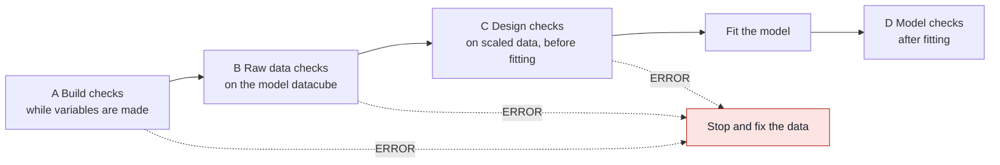

# EDA checks — what is checked in Phase 2, and why

> **Status:** planning, 2026-09-17. **No code yet.**
>
> **Companions** (same folder):
> - `VARIABLE_CREATION.md`: builds the variables these checks run on.
> - `PHASE2_ARCHITECTURE.md`: the model.
> - `PHASE2_ARCHITECTURE.html`: the one-page overview.
>
> **Meridian source:** `../../../meridian/meridian/model/eda/eda_engine.py` (checks),
> `eda/constants.py` and `eda/eda_spec.py` (thresholds), and `analysis/review/` (checks after fitting).

## Contents

1. What changes from codebase 1
2. When the checks run
3. The checks, stage by stage
4. Meridian's checks: adopted, adapted, or not
5. New checks that Meridian does not have
6. Output files
7. The running example

---

## 1. What changes from codebase 1

**Codebase 1** received **transformed** variables, built by the vendor. Its checks look at what the
model sees:
- scaling;
- dust columns;
- near-constant columns;
- collinearity on the design matrix;
- residuals.

Anything wrong in the raw media was already baked into those columns and could not be seen. A week
with spend but no GRPs, a monthly budget smeared across weeks, a national line copied into every
region: all invisible.

**Codebase 2** starts from **raw rows** and **learns** carryover and saturation. That has three
consequences.

1. **We build the variables, so we can break them.** Double counting, mixed units, wrong calendar
   mapping and lost rows become our errors to catch → **stage A**.
2. **Raw data quality becomes visible.** Spend against metric, cost per unit, currency and partial
   weeks can all be checked directly → **stage B**.
3. **The data must be able to teach the transforms.**
   - A channel that is always on at the same level cannot reveal its carryover.
   - A channel that never rises far above its typical week cannot reveal saturation.
   - Codebase 1 never had to ask this → **stages B and C**.

**Figure E1. What each codebase can see.**

```
codebase 1:  raw files ──[vendor builds + transforms]──▶ variables ──▶ checks ──▶ model
                          ▲ problems here are invisible

codebase 2:  raw files ──▶ checks A ──▶ variables ──▶ checks B, C ──▶ model learns transforms ──▶ checks D
```

---

## 2. When the checks run

**Figure E2. The four stages.**



Every finding gets a grade, using the same three levels as Meridian's EDA engine:

| Grade | What happens |
|---|---|
| **ERROR** | The run stops. Fix the data, not the model. |
| **ATTENTION** | The run continues. The finding is written to `00_warnings/`. |
| **INFO** | Reported only. |

---

## 3. The checks, stage by stage

### Stage A: build checks

These run while variables are made (`VARIABLE_CREATION.md` §8). All of them are new; neither codebase 1
nor Meridian has them, because neither builds variables.

| Check | Catches | Grade |
|---|---|---|
| Row assignment | a raw row counted in two variables, or silently lost | ERROR |
| Source totals reconcile | Σ variables + Σ excluded ≠ raw total, for any channel | ERROR |
| Unit guard | GRPs added to impressions in one variable | ERROR |
| Period split adds back | MAT or year pieces do not sum to the whole | ERROR |
| Hero + halo integrity | hero + halo ≠ that sub-brand's total activity | ERROR |
| Currency | more than one currency in one spend total | ERROR |
| Unmapped values | a value with no group, e.g. a new retailer code | ATTENTION |
| Calendar mapping | sources with different week starts; monthly rows spread across weeks | INFO, with the rule that was used |
| Empty combinations | split combinations with no activity (dropped) | INFO |

### Stage B: raw data checks

These run on the built datacube, before any scaling.

| Check | Catches | Grade | Codebase 1 | Meridian |
|---|---|---|---|---|
| Panel completeness | missing region-weeks; irregular dates | ERROR for gaps in the KPI | rectangular-panel check | — |
| KPI variability | a KPI with nothing to explain | ERROR | — | `check_overall_kpi_invariability`, ERROR |
| Spend vs metric | spend with a zero metric, or a metric with zero spend | ATTENTION | — | `check_cost_per_media_unit`, ATTENTION |
| Cost-per-unit outliers | a week whose spend ÷ metric is far from that channel's usual (1.5 × IQR) | ATTENTION | — | same rule, ATTENTION |
| Dust columns | every non-zero value around 1e-15 (the coupon extract) | ERROR | `min_feature_scale` | — |
| Sparse variables | fewer than 5 active weeks | ATTENTION | flagged only after fitting (`data_support`) | — |
| Outliers | robust z-score above 3.5 on a raw column | ATTENTION | only influential points after fitting | IQR outliers inside `check_std` |
| Partial final week | anomalies in the last week | ATTENTION | — | — |
| **Carryover learnable** | a carried-over channel with no off-weeks, so decay cannot be separated from level | ATTENTION | — | — |
| **Saturation learnable** | a saturating channel whose 95th-percentile active week is below ~1.5× its median, so there is no range to bend the curve over | ATTENTION | — | — |
| **Adstock warm-up** | a long lag window with no media history before week 1 | INFO | — | Meridian accepts extra media history |
| **On/off regime** | a variable that starts or stops mid-panel, and can look like a trend | ATTENTION | — | — |

### Stage C: design checks

These run on scaled data, before fitting. Media columns are measured on **raw scaled media** and
labelled as such, because the transforms are not known yet. The same checks are repeated after fitting,
at the posterior-median transform (stage D).

| Check | Catches | Grade | Codebase 1 | Meridian |
|---|---|---|---|---|
| Pairwise correlation | two columns moving together | ATTENTION at \|r\| ≥ 0.8 (severe at 0.95); ERROR at ≥ 0.999 | 0.8 / 0.95 | ERROR at 0.999 only |
| VIF, centred | a column predicted by several others | ATTENTION at 5 / 10; ERROR at 1000 | 5 / 10 | ERROR at 1000 only |
| VIF, uncentred, and condition number | a column that duplicates the intercept | ATTENTION at condition number 10 / 30 | yes | no |
| Near-constant after scaling | an always-on column sitting at ~1.0 | ATTENTION | `near_constant_sd` 0.1 | sd < 1e-4, ATTENTION |
| Variable ≈ week or ≈ region | a column that is really a trend, or really a region effect (adjusted R²) | INFO | implicit in the design-matrix VIF | `check_variable_geo_time_collinearity`, INFO |
| Media vs baseline drivers | media moving with TDP, price or category (possible confounding) | ATTENTION above max(0.1, 2/√n) | `confounding_pairs`, after fitting | `PotentialBiasCheck` at 0.1, after fitting |
| Rows per parameter | more parameters than the data can support | ATTENTION below 10 | — | `check_data_param_ratio`, INFO |

### Stage D: model checks, in brief

These run after fitting.

- **Kept from codebase 1:**
  - R-hat ≤ 1.01, and divergences;
  - contraction;
  - the residual battery (Durbin-Watson, heteroscedasticity, tails, influence);
  - posterior correlation;
  - exogeneity cross-correlation;
  - posterior predictive p-value on the total;
  - P(baseline < 0).
- **New for Phase 2:**
  - collinearity at the posterior-median transform;
  - posterior correlation of decay and EC50 against β;
  - flags when a transform parameter sits at its bound;
  - EC50 compared with the observed activity range;
  - stability of the transforms across cross-validation folds.

---

## 4. Meridian's checks: adopted, adapted, or not

### Before fitting: Meridian's EDA engine

| Meridian check | Meridian's rule | Our decision | Why |
|---|---|---|---|
| `check_pairwise_corr` | ERROR at \|r\| ≥ 0.999 | **Adapt.** Keep 0.999 as the ERROR gate for true duplicates; add ATTENTION at 0.8 / 0.95 | 0.999 only catches duplicated columns. Two channels correlated at 0.95 pass Meridian, and how credit is split between them is then decided by the prior |
| `check_vif` | ERROR at VIF ≥ 1000 (centred, with a constant) | **Adapt.** ERROR at 1000; ATTENTION at 5 / 10; add uncentred VIF and the condition number | On the column that broke codebase 1's first real run, the centred VIF read 1.09 while the condition number read 23,000 |
| `check_std` | ATTENTION if sd (outliers removed) < 1e-4; IQR outliers | **Adapt.** Keep the outlier part; use codebase 1's `near_constant_sd` of 0.1 on the scaled column | 1e-4 misses columns that are nearly constant after scaling, such as TDP and price at ~1.0 |
| `check_overall_kpi_invariability` | ERROR if the KPI is constant | **Adopt** | cheap and unambiguous |
| `check_cost_per_media_unit` | ATTENTION for spend without units, or units without spend; ATTENTION for cost-per-unit outliers (1.5 × IQR) | **Adopt**, for every channel with a spend column | every source file carries spend. Used only to check data quality, never for ROI |
| `check_variable_geo_time_collinearity` | INFO: adjusted R² against geo and against time | **Adopt**, against region and against week | it names *what* a collinear column duplicates |
| `check_data_param_ratio` | INFO | **Adapt.** ATTENTION below 10 rows per parameter | our 65-feature setup sits near 1.1–1.3; that should not be silent |
| `check_population_corr_raw_media`, `check_population_corr_scaled_treatment_control` | INFO: Spearman correlation with geo population | **Not adopted** | there is no population column, and our regions are sub-brands, retail channels or retailers, not geographies |
| National-model variants | separate checks when there is one geo | **Not needed** | we always fit a panel |

### After fitting: Meridian's review checks

| Meridian check | Our decision | Why |
|---|---|---|
| Convergence at R-hat < 1.2 | **Not adopted as is.** Codebase 1 uses 1.01 | 1.2 lets unconverged chains through |
| Posterior predictive p-value, 0.05 | Adopted (already in codebase 1) | tests whether the total is plausible, not just each week |
| Negative baseline, 0.2 / 0.8 | Adopted (already in codebase 1) | |
| Prior–posterior shift | **Replaced** by contraction per parameter | finer-grained, and it also works for transform parameters |
| High variance | Covered by contraction | |
| Bias: treatment vs control correlation at 0.1 | Adopted (codebase 1 `confounding_pairs`); moved before fitting in stage C | it is a property of the data, so it can be known before fitting |
| Implausible ROI (0.5–20), ROI consistency | **Not adopted** | the basis is sales volume; there is no ROI |

---

## 5. New checks that Meridian does not have

| Check | What it adds |
|---|---|
| **Build checks** (stage A) | Meridian expects ready-made input. We build variables, so every raw row must be accounted for once |
| **Unit guard** | stops GRPs being added to impressions, e.g. when competitor media is combined |
| **Carryover learnable** | warns before fitting when a channel never goes dark, so decay and level cannot be told apart |
| **Saturation learnable** | warns when activity never rises far enough above a typical week to show diminishing returns |
| **On/off regime** | a channel that only runs in the second year competes with the trend |
| **Sparse variables before fitting** | codebase 1 only learned after fitting that `Dummy` had 5 active weeks |
| **Uncentred VIF + condition number** | the check that would have caught codebase 1's first real run |
| **Classical residual battery** | Meridian runs none; our parametric baseline leaves more in the residuals |
| **Transform bound flags** | a decay or EC50 pressed against its bound means the bound, not the data, set it |
| **EC50 vs observed range** | an EC50 beyond anything observed means saturation was not learned |
| **Decay / EC50 vs β correlation** | shows when carryover and effect size are trading off |
| **Transform stability across CV folds** | a decay that moves when the cut-off moves has not been pinned down |

---

## 6. Output files

| File | Contents |
|---|---|
| `02_eda/eda_report.md` | every finding, ranked by grade |
| `02_eda/build_checks.csv` | stage A, including the reconciliation totals |
| `02_eda/raw_checks.csv` | stage B, one row per variable × check |
| `02_eda/cost_per_unit.csv` | spend ÷ metric per variable, region and week, with outlier flags |
| `02_eda/learnability.csv` | per transformed variable: off-weeks, 95th percentile ÷ median of active weeks, first and last active week |
| `01_data/collinearity_*.csv` | stage C, in codebase 1's format and location |
| `00_warnings/` | every ERROR and ATTENTION finding, one document per category |

---

## 7. The running example

Three sub-brands (Effervescent, Liquid, Tabs) as regions, over 104 weeks. The findings below are
**illustrative**; they show what each stage looks like.

| Stage | Finding | Grade | What to do |
|---|---|---|---|
| A | trade `retailer = Fixed Expenses` has no group | ATTENTION | analyst decides: `drop` (overhead) or `all` |
| A | trade is monthly; December's spend is spread over 5 weeks by days | INFO | nothing |
| A | the combined competitor variable mixes TV GRPs with digital impressions | ERROR | use competitor spend, or keep competitor TV only |
| B | OOH has 3 weeks in 2025 with spend but zero panels | ATTENTION | check the extract. OOH uses spend as its metric, so the variable itself is unaffected |
| B | TV has no week without GRPs in 2025 | ATTENTION | decay is learned mostly from 2024; consider `fix_alpha` or a transform group |
| B | `…_ooh_…_invest_2025` is zero for all of 2024 | ATTENTION (on/off regime) | expected for a period split; read it next to the trend |
| C | `…_unattr_grps` and `…_effervescent_hero_grps` correlate at 0.86 in the Effervescent region | ATTENTION | read the pair together, and check their posterior correlation after fitting |
| C | 1.2 rows per parameter | ATTENTION | use transform groups; merge the two OOH years if the split is not needed |
