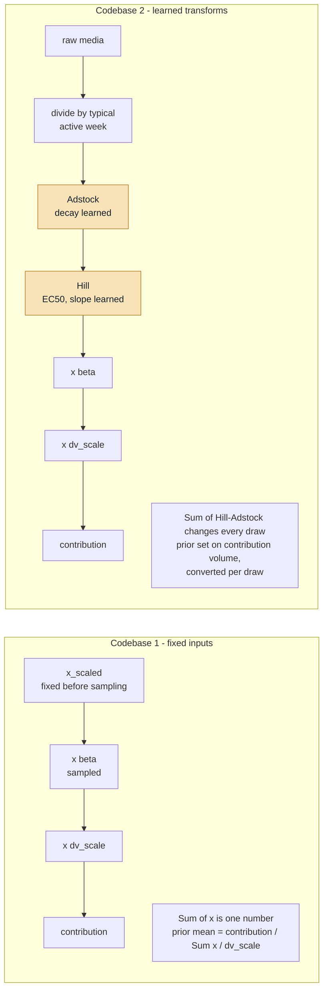
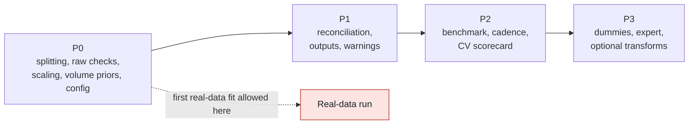
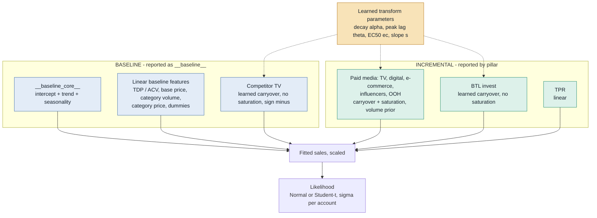
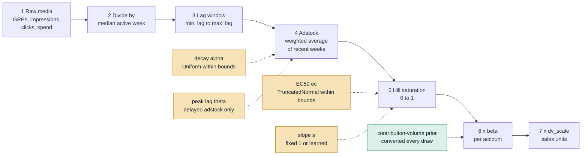
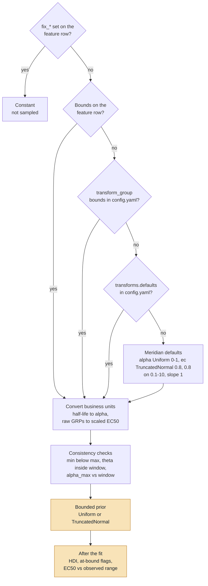
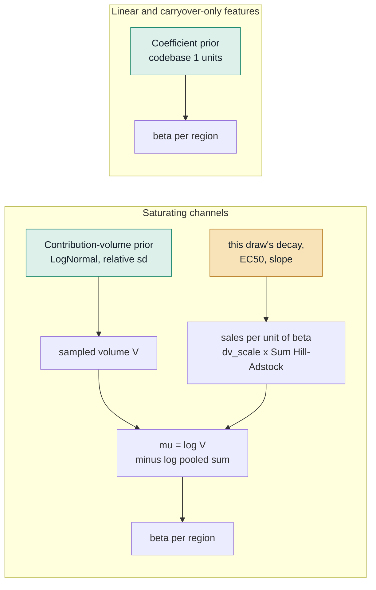
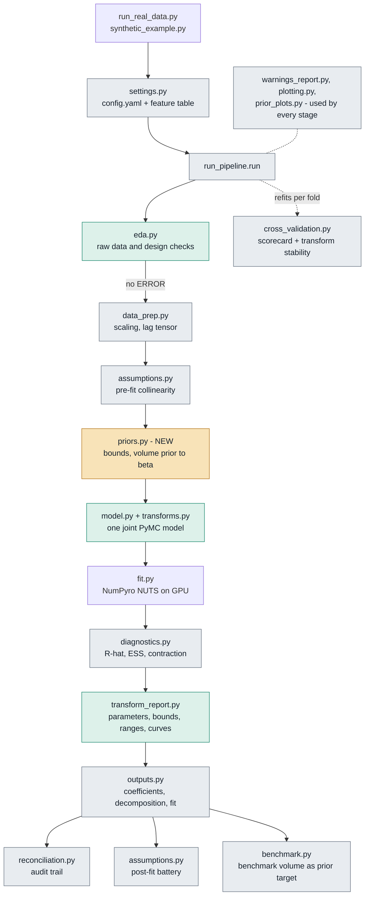

# Codebase 2 — Phase 2 architecture blueprint

> **Status:** blueprint, 2026-09-14. **No code has changed yet.** `codebase2_full_mmm/` still
> predates the v1.5 scaling fix. Do not fit it on client data until the **P0** items in §4 are done.
>
> **Decisions of record:** `../../CLAUDE.md` (the Phase 2 brief). **Meridian source:**
> `../../../meridian/meridian/` (read-only). Every Meridian claim below carries a file pointer.
> **One-page overview:** `Codebase_2_blueprint.html` in this folder. (`PHASE2_ARCHITECTURE.html` is an
> HTML render of this file.)
> **Companions:** `METHODOLOGY.md` (the order to build in), `EXPLANATION.md` (what the
> transforms do and how they move the numbers) and `EDA_CHECKS.md` (what is checked).

Written for the MMM team. Meridian's vocabulary is translated into standard MMM terms
throughout: decay (adstock), EC50 (half-saturation), coefficients, random effects, contribution priors,
baseline.

## Contents

- **0. Summary**
- **1. Where we stand**
- **Part A — What codebase 1 brings**
  - 2. Adoption table
  - 3. Adapt, don't copy
  - 4. Roadmap
- **Part B — How codebase 2 works**
  - 5. The model in one equation
  - 6. Feature roles for our data
  - 7. Data preparation
  - 8. The transformation chain
  - 9. How min and max are calculated
  - 10. Priors: sales-volume basis
  - 11. Identifiability, sampling, data sufficiency
  - 12. Module architecture
  - 13. Configuration design
  - 14. EDA stage
  - 15. Outputs
  - 16. Validation and tests
  - 17. What Phase 2 does not fix
  - 18. Glossary and source pointers

---

## 0. Summary

**The one rule.** Codebase 2 takes **raw** media: weekly GRPs, impressions, clicks and spend.
It learns three things *inside* the model, jointly with the coefficients:
- carryover (adstock);
- the delay before an effect peaks (lag);
- diminishing returns (Hill saturation).

Never feed it pre-adstocked or pre-saturated columns. That transforms the data twice.

### Answer 1 — what codebase 1 brings

Codebase 1 is the finished infrastructure: the scaling rule, prior units, the `config.yaml` front
end, the collinearity and residual battery, the reporting vocabulary (baseline, pillar, reference),
the reconciliation audit trail, and run hygiene (warning documents, one plotting owner).
Codebase 2 has almost none of it.

- **Direction of travel:** codebase 1 infrastructure goes *into* codebase 2, never the reverse.
- **31 capabilities** are listed in §2.
- **7 of them cannot be copied as-is**, because learned transforms break an assumption they rest on
  (§3).
- **Build order:** P0 → P1 → P2 → P3 (§4).

### Answer 2 — how codebase 2 works

- **One joint hierarchical model** over all 5 retailer accounts (§5).
  - The **baseline** is intercept + trend + seasonality + dummies + distribution (TDP/ACV) +
    base price + category volume + category price. Competitor TV is also in it, with learned
    carryover.
  - **Incremental** effects are paid media (learned carryover + saturation), BTL invest (learned
    carryover) and TPR (linear).
- **For each media channel**, the chain is: raw → ÷ a typical active week → lag window →
  adstock → Hill → × regional coefficient (§8).
- **Decay, peak lag, EC50 and slope** are learned **once per channel (or channel family)** and
  shared across accounts. The coefficient differs by account.
- **Min and max** (§9):
  - every transform parameter has a bounded range;
  - you write ranges in business units (half-life in weeks, EC50 in GRPs) and they are converted
    for you;
  - `max_lag` is derived from the slowest decay you allow;
  - `min_lag` is a fixed delay chosen by cross-validation.
- **Priors stay on a sales-volume basis**, as in codebase 1. **No ROI.**
  - For a saturating channel, the prior is written on its contribution volume (for example the
    vendor's volume ±20%). It is converted into a coefficient on every draw, because the transformed
    media changes on every draw (§10).
  - Every other feature keeps codebase 1's coefficient priors.
- **Variables arrive already built** to the data structure. The only preparation is splitting
  one by region or by period (`METHODOLOGY.md` §1). The earlier builder design is parked.
- **The raw data is checked before fitting** (`EDA_CHECKS.md`).
- **The region is a setting.** It is the retailer accounts in codebase 1's datacube, and the three
  sub-brands (Effervescent, Liquid, Tabs) in the running example the other Phase 2 documents share.

### The work, phase by phase

| Phase | What happens | Where it is designed |
|---|---|---|
| 1. Prepare the variables | the datacube arrives built; split by region or period where needed | `METHODOLOGY.md` §1 |
| 2. Check raw data | build checks, raw-data checks, design checks | `EDA_CHECKS.md` |
| 3. Prepare | scaling, lag tensor, parameter bounds and lag windows | §7, §9 |
| 4. Fit | one joint model; transforms learned in-model | §5, §8, §10 |
| 5. Diagnose | convergence, contraction, transform flags, residuals | §11, §15 |
| 6. Cross-validate | expanding-window refits, scorecard, choosing between specifications | §16 |
| 7. Report | volume decomposition, reconciliation, benchmark | §15 |

### Decisions of record

| Decision | Date |
|---|---|
| Spend exists in every source file. It is used for data checks, and as the metric where a channel has nothing else | 2026-09-14 |
| **No ROI.** Priors and contributions stay on sales volume. This reverses the ROI default of 2026-09-14 | 2026-09-17 |
| Trade and Competitor TV defaults (table below) | 2026-09-14 |
| `baseline=1` on `sales_market_*`, `dummy_*` and Competitor TV, to match the baseline definition (§5) | 2026-09-14 |
| Competitor media is combined into one variable by default | 2026-09-17 |
| Pending: what a dummy is in our context; the TPR source (probably trade Price Promotions); the expert file's columns | 2026-09-17 |

The Trade and Competitor TV defaults:

| Feature | Treatment | Sign | Reported in |
|---|---|---|---|
| Competitor TV | learned carryover, no saturation | negative | the baseline |
| TPR | linear | positive | Trade pillar |
| BTL invest | learned carryover over at most 4 weeks, no saturation | positive | Trade pillar |

---

## 1. Where we stand

| | Codebase 1 `codebase1_hierarchical_mmm/` | Codebase 2 `codebase2_full_mmm/` |
|---|---|---|
| Input | pre-transformed features | **raw** media + spend |
| Transforms | fixed upstream, invisible to the model | **learned in-model** |
| Status | live, 995 local checks, eight real-data runs | early design, ~2,570 lines, no work since |
| Scaling | `resolve_scaling`: every column, both sides of every transform | hard-wired per column type. **The v1 defect is still present** |
| Priors | `prior_sd_basis` / `prior_mean_basis`, three pooling modes | a raw log-scale sd, hierarchical/global only |
| Front end | `config.yaml` + prior CSV | Python driver |
| Diagnostics | collinearity on the design matrix, residual battery, structural checks | raw-data VIF in `eda.py` |
| Reporting | baseline / pillar / reference, full reconciliation chain | contributions, ROI, transform report |

### What codebase 2 has that must survive the port

| File | What it gives you |
|---|---|
| `transforms.py` | adstock (geometric + delayed) and Hill, in pytensor (inside the model) and numpy (reporting). `adstock_weights_pt` already multiplies by a `lag_mask` before normalising |
| `config.py::ChannelSpec` | per-channel control: `adstock`, `max_lag`, `learn_slope`, `fix_alpha` / `fix_ec` / `fix_slope` / `fix_theta` |
| `model.py::build_model` | `raw_alpha` Uniform(0,1), `raw_theta` Uniform(0, min(6, max_lag−1)), `raw_ec` TruncatedNormal(0.8, 0.8, [0.1, 10]), slope 1.0 or LogNormal(0, 0.35). Transforms are shared across regions; `beta_media` is hierarchical log-normal |
| `data_prep.py` | media ÷ per-region median of positive training weeks; the `(G,T,L,C)` lag tensor |
| `transform_report.py` | `transform_parameters.csv` (incl. EC50 in raw units), `adstock_ranges.csv`, decay and saturation curves |
| `eda.py` | panel gaps, media summary, cost consistency, outliers |
| `cross_validation.py` | `cv_transform_stability.csv`: do decay and EC50 hold across folds? |

`fit.py` and `compat.py` are **line-for-line identical** in the two codebases. Keep them in sync.

**Figure D1. Direction of travel.**

```mermaid
flowchart LR
    subgraph CB1["Codebase 1 - live infrastructure"]
        S1["Scaling rule<br/>resolve_scaling, dv_scale"]
        P1["Prior units + pooling<br/>resolve_prior_params"]
        Y1["config.yaml front end<br/>settings.py"]
        A1["Assumption battery<br/>assumptions.py"]
        R1["Reporting vocabulary<br/>baseline, pillar, reference"]
        C1["Reconciliation<br/>reconciliation.py, OutputConfig"]
        V1["CV scorecard, cadence,<br/>warnings, plotting, benchmark"]
    end
    subgraph CB2["Codebase 2 - Phase 2 target"]
        T2["Transform core<br/>transforms.py"]
        M2["Learned decay, lag, EC50, slope<br/>model.py"]
        TR2["Transform report<br/>transform_report.py"]
        E2["EDA stage<br/>eda.py"]
        N2["NEW priors.py<br/>bounds + volume prior inversion"]
        G2["NEW raw-data checks<br/>+ transform diagnostics"]
    end
    CB1 ==>|ported into, never the reverse| CB2
    classDef keep fill:#DDF1EA,stroke:#1F8A70,color:#16202B
    classDef port fill:#E8ECF0,stroke:#6B7684,color:#16202B
    classDef new fill:#F8E3B8,stroke:#B7791F,color:#16202B
    class T2,M2,TR2,E2 keep
    class S1,P1,Y1,A1,R1,C1,V1 port
    class N2,G2 new
```



Grey is ported from codebase 1. Green is kept from codebase 2. Amber is new in Phase 2.

---

# Part A — What codebase 1 brings

## 2. Adoption table

How to read it:
- **Codebase 1 source** is `file::function` in `codebase1_hierarchical_mmm/`.
- **Action** is one of:
  - **port**: copy the logic;
  - **port + adapt**: copy it, then change it for learned transforms (see §3);
  - **new**: no codebase 1 equivalent.
- **P** is the priority from §4.

### A. Scaling and units

| Capability | Codebase 1 source | In plain words | Codebase 2 today | Action | P |
|---|---|---|---|---|---|
| One scaling helper for every column | `data_prep.py::resolve_scaling` | returns *(centre, scale)*; every column becomes `(v − centre) / scale`, using training-window stats only | hard-wired per column type | **port + adapt**: add `median_positive`, the statistic codebase 2 already uses for media | P0 |
| Per-feature centring and scaling | `FeatureSpec.center_mode`, `scale_mode` | lets always-on level variables (TDP, price) be centred. This is the v1 fix | signed linear features are scale-only, **the v1 defect** | port | P0 |
| KPI scale = unit of the priors | `RunConfig.dv_center`, `dv_scale`, `dv_scale_scope` | priors derived on another scale can be expressed; the inverse transform stays exact | fixed per-region standardise | port | P0 |
| Data guards | `RunConfig.zero_threshold_rel`, `min_feature_scale`, `near_constant_sd` | catches dust columns (the coupon extract at ~1e-15) and flat always-on columns | none | port, and apply to spend | P0 |

### B. Priors

| Capability | Codebase 1 source | In plain words | Codebase 2 today | Action | P |
|---|---|---|---|---|---|
| Prior units | `config.py::resolve_prior_params`, `lognormal_sigma`, `lognormal_moments`; `prior_sd_basis`, `prior_mean_basis` | writing `0.2` with `relative` really means ±20%; median vs mean is explicit | `prior_beta_sd` on the raw log scale, no conversion | **port, then reuse for contribution-volume priors** (§10) | P0 |
| Three pooling modes | `FeatureSpec.pooling`; buckets `h*` / `i*` / `g*` in `model.py::_bucket_betas` | per feature: shrink accounts toward a shared mean, estimate each alone, or share one coefficient | hierarchical or global only | port the `independent` buckets | P0 |
| Region-specific priors | `RegionPrior`, `validate_region_priors` | override one retailer's prior; a misspelt region stops the run | none | port | P1 |
| Intercept switch | `ModelConfig.include_intercept`, `INTERCEPT_PARAMS` | vendor-style decomposition with no free intercept | always on | port | P2 |

### C. Configuration

| Capability | Codebase 1 source | In plain words | Codebase 2 today | Action | P |
|---|---|---|---|---|---|
| YAML front end | `settings.py::load_settings`, `run_from_yaml`, `HELP`, `write_default_yaml`; `config.yaml` | every setting listed at its default with one line of help; a typo is an error; writes `01_data/resolved_config.yaml` | hand-edited Python driver | **port + adapt**: add `transforms:`, `priors:` and `eda:` sections (§13) | P0 |
| Feature table | `config.py::load_feature_config` (the prior CSV) | one row per modelled column | `load_channel_config` (media) plus `FeatureSpec` objects (controls) | **port + adapt**: **one** table, with transform columns (§13) | P0 |

### D. Assumptions and diagnostics

| Capability | Codebase 1 source | In plain words | Codebase 2 today | Action | P |
|---|---|---|---|---|---|
| Collinearity on the design matrix | `assumptions.py::design_matrix`, `vif`, `condition_index`, `correlation_pairs`, `write_collinearity` | what the data can separate, including a column that duplicates the intercept (uncentred VIF + Belsley condition number) | VIF on raw data in `eda.py` | **port + adapt** (§3, item 3) | P0 |
| Threshold config | `config.py::AssumptionConfig` (25 thresholds) | widen or narrow any check from `config.yaml` | constants in code | port | P0 |
| Residual battery | `assumptions.py::residual_assumptions` | linearity, Durbin-Watson, heteroscedasticity, tails, influence | none | port | P0 |
| Structural checks | `confounding_pairs`, `exogeneity_cross_correlation`, `posterior_predictive_p`, `negative_baseline_probability` | the three checks adopted from Meridian, plus feature vs residual at leads and lags | none | port | P1 |
| Posterior trade-offs | `assumptions.py::posterior_correlation` | which coefficient pairs the model cannot separate | none | **port + adapt**: add decay / EC50 / peak lag vs β | P1 |
| Contraction bookkeeping | `diagnostics.py::prior_posterior_report`, `_use_for_delta`, `_role_of` | exactly one parameter family per feature feeds the delta arithmetic; separate `feature` and `region` columns | basic contraction table | **port + adapt**: add transform parameters and log contribution volume | P1 |

### E. Reporting vocabulary

| Capability | Codebase 1 source | In plain words | Codebase 2 today | Action | P |
|---|---|---|---|---|---|
| Baseline flag | `FeatureSpec.baseline`; `Decomposition.core_draws`, `baseline_features` | `__baseline__` = `__baseline_core__` + every `baseline=1` feature; each part is still listed | baseline = intercept + seasonality + trend only | port | P1 |
| Contribution reference | `FeatureSpec.contribution_reference`; `outputs.py::compute_decomposition` (`contrib_shift`) | measure a driver against zero, its mean, its minimum or a number. Reporting only; the fit does not change | none | **port + adapt**: media always vs zero; propose `max` for price | P1 |
| Pillars | `FeatureSpec.pillar`; `contribution_by_pillar.csv`; `baseline_breakdown.png` | vendor-style roll-up (Trade, TV, Online Media, Baseline) | none | port | P1 |

### F. Reconciliation

| Capability | Codebase 1 source | In plain words | Codebase 2 today | Action | P |
|---|---|---|---|---|---|
| Audit trail | `reconciliation.py::write_model_input`, `write_prior_summary`, `write_actual_vs_predicted`, `write_contribution_timeseries`, `write_contribution_summary`, `write_contribution_reconciliation`, `write_contribution_math` | every reported number can be re-derived by hand, from raw input to actual sales | none | **port + adapt** (§3, item 1) | P1 |
| Output switches | `config.py::OutputConfig` (`core_only`, `tables_only`) | light runs; no PNG floods on Databricks `/Workspace` | writes everything | port | P1 |

### G. Run hygiene

| Capability | Codebase 1 source | In plain words | Codebase 2 today | Action | P |
|---|---|---|---|---|---|
| Warning documents | `warnings_report.py::collect_warnings`, `write_warning_docs` | `00_warnings/00_INDEX.md` plus one document per category, instead of 65 repeated paragraphs | printed | port; add categories for transform bounds, build checks and raw-data checks | P1 |
| One figure owner | `plotting.py::set_figure_defaults`, `save_fig`, `annotate`, `units_note` | consistent size, dpi and labels; WSFS-safe saving | local `save_fig` copies | port | P1 |
| Prior / posterior charts | `prior_plots.py::write_prior_posterior_plots`, `implied_likelihood` | the three-curve chart per parameter | none | port | P2 |

### H. Coefficient-report semantics

| Capability | Codebase 1 source | In plain words | Codebase 2 today | Action | P |
|---|---|---|---|---|---|
| Honest significance | `outputs.py::coefficient_report`: `t_stat` (mean ÷ posterior sd), `p_value_basis`, `prob_negligible` + `OutputConfig.rope_scaled`, `data_support` incl. near-constant | no sampler-length-dependent t-stats; a real "negligible?" probability for sign-constrained features | P(>0) and a basic support flag | port | P2 |
| Like-for-like fit metrics | `outputs.py::fit_report`: `r2_within_region`, `__aggregate__` row | compare with national vendor models; don't quote the pooled R² | per-region R², `__all__` | port | P2 |

### I. Periods, cross-validation, benchmark

| Capability | Codebase 1 source | In plain words | Codebase 2 today | Action | P |
|---|---|---|---|---|---|
| Cadence presets | `config.py::PeriodPlan`, `resolve_period_plan`, `infer_cadence` | weekly and monthly panels get sensible holdout, MAT and CV counts | hard-coded 13 / 52 | port | P2 |
| Model selection | `cross_validation.py::scorecard`, `select_model`, `compare_cv_runs`; `CVConfig.enabled`, `resolved` | gate → accuracy beyond one standard error → stability → parsimony | `run_cv` with no scorecard | port; **keep** transform stability | P2 |
| Benchmark sheet | `benchmark.py::write_benchmark_comparison`, `load_mapping`, `sheet_rows`, `benchmark_values` | paste a vendor contribution; live formulas; regions across the columns; group + member rows (R on the group, contraction per member) | none | **port + adapt** (§3, item 2) | P2 |

### J. Tests and shared modules

| Capability | Codebase 1 source | In plain words | Codebase 2 today | Action | P |
|---|---|---|---|---|---|
| Tests with no PyMC | `tests/run_all.py` (995 checks, stubbed pymc and matplotlib) | scaling, decomposition and reporting logic run on a laptop | none | **new** suite `tests_phase2/`. Do not extend the codebase 1 suites | P0 |
| Sampler and trace shims | `fit.py`, `compat.py` | NumPyro/JAX on GPU with fallbacks; InferenceData vs DataTree | identical files | keep in sync | — |

---

## 3. Adapt, don't copy

Codebase 1 assumes every column the sampler sees is **fixed before sampling**. Learned transforms
break that. The seven places it matters:

1. **`contribution_math`.**
   - Codebase 1 prints `volume = β × Σ(x_scaled + shift) × dv_scale`, where Σx is one fixed number.
   - For a Hill channel the sum is `Σ Hill(Adstock(x))`, which changes on every draw.
   - Print it at the **posterior-median transform** (labelled as such), next to the median of the
     per-draw totals and the gap between them.
2. **Benchmark prior correction.**
   - Codebase 1 corrects a prior as `prior_mean = contribution ÷ Σx ÷ dv_scale`. For a Hill channel
     Σx is not fixed, so there is no single coefficient to correct.
   - The correction moves onto **contribution volume**. The benchmark's volume becomes the prior
     target directly, and the model converts it into a coefficient on every draw (§10).
3. **`design_matrix` for collinearity.**
   - Pre-fit, measure media on **raw scaled media**. This is what the data can separate before any
     transform.
   - Post-fit, repeat the check at the **posterior-median transform**.
   - Label both. Never present the raw-media VIF as the model's.
4. **`posterior_correlation`.**
   - Add decay α, EC50 and peak lag θ against each channel's β.
   - A longer carryover with a smaller coefficient draws almost the same line. This table is where
     that shows.
5. **Contraction.**
   - Add `raw_alpha_*`, `raw_ec_*`, `raw_theta_*`, `raw_slope_*` and the log contribution volume.
   - `use_for_delta` rules: the log contribution volume is the delta family for saturating channels. Transform
     parameters are reported but never feed the delta.
6. **`contribution_reference` for media.**
   - A media channel is always measured against **zero activity**. That is the counterfactual Meridian
     uses for incremental outcome (`linear_predictor_counterfactual_difference_media` with no calibration period).
   - "Versus mean media" would need the transforms re-run at a counterfactual input, and is not
     offered.
7. **The exception: carryover-only features** (Competitor TV, BTL invest).
   - Normalised adstock **preserves volume**: `Σ_t Adstock(x) = Σ_t x`, minus the carryover of the
     final weeks that would land after the data ends.
   - So codebase 1's coefficient-prior arithmetic still holds for them.
   - **Only saturation breaks it.**

**Figure D2. Why the contribution arithmetic changes.**



---

## 4. Roadmap

This is the CLAUDE.md port plan, updated for the one genuinely new piece of work: the raw-data and
transform checks.

**P0: before any real-data run**
- Contents:
  - variable splitting by region and period, with its checks (`METHODOLOGY.md` §1);
  - raw-data and design checks (`EDA_CHECKS.md` stages B–C);
  - `resolve_scaling`, with the centring and scaling modes and `dv_scale*`;
  - prior units, plus the contribution-volume prior conversion (§10);
  - `settings.py`, `config.yaml` and the one feature table;
  - `tests_phase2/` skeleton.
- Done when:
  - split pieces add back to their parent, every week and region;
  - the v1 always-on level-variable case passes;
  - a synthetic run recovers a known contribution volume.

**P1: before anyone reads output**
- Contents:
  - `reconciliation.py`, with `contribution_math` adapted;
  - `OutputConfig`;
  - baseline / reference / pillar;
  - `warnings_report.py` and `plotting.py`;
  - contraction, posterior correlation and bound flags on transform parameters.
- Done when:
  - every identity in `contribution_reconciliation.csv` holds on every draw;
  - the v7 variables rebuild from recipes.

**P2: quality of life**
- Contents:
  - `benchmark.py`, on volume;
  - `prior_plots.py`;
  - cadence / `PeriodPlan`;
  - CV scorecard and `select_model`;
  - `include_intercept`;
  - `rope_scaled` / `prob_negligible`;
  - `data_support`.
- Done when: CV compares recipe variants and `min_lag` variants using the one-standard-error rule.

**P3: new or pending**
- Contents:
  - dummies, once defined;
  - the expert source, once its columns are known;
  - binomial decay;
  - `hill_before_adstock`;
  - response curves;
  - a spline (knot) baseline option.
- Done when: each item ships with its own recovery test.

**Figure D3. Build order.**



---

# Part B — How codebase 2 works

## 5. The model in one equation

Per retailer account `g` (5 of them) and week `t`, on the scaled axes (§7):

```
sales[g,t] =
   BASELINE ─────────────────────────────────────────────────────────────────────────
     intercept_g                                     account level, pooled across accounts
   + trend_g · t                                     pooled linear trend
   + Σ_k γ_k · Fourier_k(t)                          annual seasonality, shared
   + Σ_d γ_d · dummy_d[t]                            event dummies, one shared coefficient each
   + Σ_j β[g,j] · x̃[g,t,j]                           TDP / ACV, base price (−), category volume, category price
   − β[g,cTV] · Adstock_α( competitor TV )[g,t]      carryover learned, no saturation
   INCREMENTAL ──────────────────────────────────────────────────────────────────────
   + Σ_m β[g,m] · Hill_ec,s( Adstock_α,θ( media_m ) )[g,t]    TV, digital, e-commerce, influencers, OOH
   + Σ_b β[g,b] · Adstock_α( BTL_b )[g,t]                     BTL price-promotion and shopper invest
   + Σ_p β[g,p] · x̃[g,t,p]                                    TPR
   + ε[g,t]        ε ~ Normal(0, σ_g)  or Student-t
```

- `x̃` is a scaled column.
- Every signed coefficient is built as `β = ±exp(μ + τ·z_g)`, so its sign is structural. Each
  account gets its own β, shrunk toward a shared mean.
- **α, θ, ec and s are learned once per channel (or channel family) and shared by all accounts.**
  Meridian does the same.

**The same equation in Meridian's terms** (`model/posterior_sampler.py::_joint_dist_base_logic`):
`tau_g + mu_t + Σ beta_gm·AdstockHill(media) + Σ gamma_gc·controls + Σ gamma_gn·non_media`.

Three deliberate differences:
1. **Time baseline.** Ours is intercept + linear trend + Fourier seasonality. Meridian uses a spline
   over time knots (`knots.py::l1_distance_weights`).
2. **Account intercepts.** Ours are pooled. Meridian pins one baseline geo at zero
   (`posterior_sampler.py::_compute_tau_g`).
3. **Price, promotion and distribution levers.** Meridian's `non_media_treatments` are our linear
   features, reported in the baseline or in the Trade pillar.

**Figure D4. The two blocks.** Amber marks parameters codebase 1 fixed by hand upstream and codebase 2 learns.



### Baseline is a reporting choice; transformation is a modelling choice

**Figure D5.** The two switches are independent. Every family sits in exactly one cell.

```
                      LINEAR  (transform = none)             TRANSFORMED  (learned in-model)
                   ┌───────────────────────────────────────┬───────────────────────────────────────┐
  BASELINE         │ intercept, trend, seasonality (core)  │ Competitor TV                         │
  baseline = 1     │ TDP / ACV distribution                │   carryover α, no saturation, sign −  │
  (summed into     │ base price (AVP)             sign −   │                                       │
   __baseline__)   │ category volume, category price       │                                       │
                   │ event dummies                         │                                       │
                   ├───────────────────────────────────────┼───────────────────────────────────────┤
  INCREMENTAL      │ TPR                     Trade pillar  │ TV, digital, e-commerce, influencers, │
  baseline = 0     │                                       │ OOH: carryover α (θ) + Hill ec, s     │
  (reported by     │                                       │ BTL promo / shopper invest:           │
   pillar)         │                                       │   carryover α, no saturation (Trade)  │
                   └───────────────────────────────────────┴───────────────────────────────────────┘
                     ↑ the `baseline` flag moves a row up or down; the `transform` column moves it across
```

### Edits the v7 prior file needs to match this baseline

| Rows in `feature_priors_v7.csv` | Today | Change to |
|---|---|---|
| `sales_market_all-benefit_base_sales-volume`, `sales_market_all-benefit_price_base-price_Tabs` | `baseline=0`, pillars *Competitor Sales* / *Competitor Price* | `baseline=1` |
| `dummy_*` (21 rows) | `baseline=0`, pillar *Baseline* | `baseline=1` |
| `media_competitor-tv_…_grps` | `baseline=0`, pillar *Competitor TV* | `baseline=1`; `transform=geometric`; `saturation=none` |
| `sales_brand_…_distribution_tdp_*`, `sales_brand_…_price_base-price_*` | `baseline=1` | no change |

In codebase 1 the **pillar** roll-up already files the dummies under *Baseline*. But `__baseline__`
itself is decided by the **flag**, not the pillar name, so the dummies are not in it today.

---

## 6. Feature roles for our data

These are starting assumptions for the team to confirm. The lag windows and decay caps are derived
with the rules in §9.2, from the slowest decay each family is allowed.

| Family (v7 columns) | n | Transform | Saturation | Lag window | Decay cap | Scaling | Sign | Pooling | Prior | `baseline` | Pillar |
|---|---|---|---|---|---|---|---|---|---|---|---|
| TV `media_tv_*_grps` | 9 | geometric (delayed if the team expects build-up) | Hill | 0–13 wk | α ≤ 0.807 (half-life ≤ 3.2 wk) | median of active weeks | + | hierarchical | **contribution volume** | 0 | TV |
| Digital, e-commerce, influencers `*_impressions`, `*_clicks` | 15 | geometric | Hill | 0–8 wk | α ≤ 0.717 (half-life ≤ 2.1 wk) | median of active weeks | + | hierarchical | **contribution volume** | 0 | Online Media |
| OOH `media_ooh_*_invest_2024/2025` | 2 | delayed, θ ∈ [0, 2] | Hill | 0–8 wk | α ≤ 0.717 | median of active weeks | + | hierarchical | **contribution volume** (metric = spend) | 0 | Online Media |
| Competitor TV `media_competitor-tv_*` | 1 | geometric | none | 0–13 wk | α ≤ 0.807 | median of active weeks | − | hierarchical | coefficient | **1** | Competition |
| BTL `btl_*_invest_*` | 6 | geometric | none | 0–4 wk | α ≤ 0.549 (half-life ≤ 1.2 wk) | median of active weeks | + | hierarchical | coefficient | 0 | Trade |
| TPR `sales_brand_*_trade_tpr_*` | 3 | none | — | — | — | mean of positives, or centred if always on | + | hierarchical | coefficient | 0 | Trade |
| Distribution `…_distribution_tdp_*` (ACV) | 3 | none | — | — | — | centre mean, scale sd | + | hierarchical | coefficient | 1 | Baseline |
| Base price `…_price_base-price_*` (AVP) | 3 | none | — | — | — | centre mean, scale sd | − | hierarchical | coefficient | 1 | Baseline |
| Category volume and price `sales_market_*` | 2 | none | — | — | — | centre mean, scale sd | + | hierarchical | coefficient | **1** | Baseline |
| Event dummies `dummy_*` | 21 | none | — | — | — | none / none | free | global | coefficient | **1** | Baseline |
| Core: intercept, trend, Fourier | — | — | — | — | — | — | — | pooled | model block | core | Baseline |

- **Reference.** Every contribution is measured against zero. For price, §9.3 proposes an
  additional `max` option ("versus price at its highest").
- **OOH columns.** `ooh_…_2024` and `ooh_…_2025` are one activity split by year. Merge them unless
  the split is deliberate.
- **The 27-feature retailer datacube maps the same way:**
  - TDP, AVP and `ACV_WD_Any Merch` → linear baseline features, centred;
  - TV and digital media columns → transformed;
  - coupons → excluded (broken extract);
  - `Dummy` (5 non-zero account-weeks) → dropped.

---

## 7. Data preparation

All statistics are computed on the **training window only**. Every inverse transform uses the
same stored numbers.

| Column type | Centre | Scale | Why | Meridian equivalent (`model/transformers.py`) |
|---|---|---|---|---|
| KPI `dv` | training mean per account | training sd per account | coefficients read "account sd of sales" | `KpiTransformer`: per capita, one global mean and sd |
| Transformed media: TV, digital, OOH, Competitor TV, BTL | none | **median of positive training weeks**, per account × channel | zero activity stays zero; **EC50 lives on this axis** | `MediaTransformer`: one per-channel median of non-zero values × population |
| Level drivers: TDP / ACV, base price, category volume and price | training mean | training sd | always-on columns would otherwise duplicate the intercept (the v1 defect) | `CenteringAndScalingTransformer` |
| TPR | none if zero means "no promotion"; mean if always on | mean of positives, or sd | the `near_constant_sd` guard tells you which | non-media treatment |
| Event dummies | none | none | already 0 / 1 | control |

> **The scale is the unit of the priors, and of EC50.** Rescale media and every EC50 bound moves
> with it. Rescale the KPI and every coefficient prior moves. The decomposition still reconciles
> to 100% either way, so no reconciliation check can catch a mismatch. This is the Phase 1 scaling
> rule with one new surface.

v7 passes every column through unscaled (`none/none`), because its priors were derived on that
axis. Transformed media cannot do that: EC50 needs the "typical active week" axis. When a level
driver switches to centring, re-derive its prior on the new axis (METHODOLOGY §1, stage 2).

**Figure D6. The lag tensor** (`data_prep.py::make_lag_tensor`).

```
Mlag[g, t, l, c] = scaled media of channel c, account g, l weeks before week t

               l = 0       l = 1       l = 2      …    l = max_lag
  week t=0   [ x(0)        0           0          …    0            ]  ← no history: zero-padded
  week t=1   [ x(1)        x(0)        0          …    0            ]
  week t=2   [ x(2)        x(1)        x(0)       …    0            ]
     ⋮
  week t     [ x(t)        x(t−1)      x(t−2)     …    x(t−max_lag) ]

  adstock[g,t,c] = Σ_l  w_l(α, θ) · Mlag[g,t,l,c]      with Σ w_l = 1 over [min_lag, max_lag]
```

**Missing history at the start of the series.** Take TV with α = 0.8 and `max_lag` = 13, and no
earlier media supplied. Each week's adstock then misses this share of its weight:

| Week of series | 0 | 1 | 2 | 3 | 5 | 8 | 10 | 13 |
|---|---|---|---|---|---|---|---|---|
| Weight falling before the data starts | 79.1% | 62.3% | 49.0% | 38.2% | 22.8% | 9.4% | 4.4% | 0.0% |

**Lead-in media.** Supply media (only media, no KPI) for the weeks before the KPI window, via
`media_lead_in`. Meridian does the same by allowing more media weeks than KPI weeks
(`model/adstock_hill.py::_adstock`). If lead-in media isn't available, report the understatement
rather than hiding it.

**Two scaling notes carried into the design:**
1. **Median scope.**
   - Meridian takes one median per channel across all geos and weeks. We take one per account.
   - For national media (identical GRPs in every account) the two are the same number.
   - `media_scale_scope: region | global` exposes the choice (P2).
2. **National spend.**
   - National media repeats in all 5 accounts. Spend must be **allocated** across accounts (by
     sales or delivery share), not repeated.
   - Otherwise spend totals and cost-per-unit checks are 5× too high. Spend is read at the level
     the datacube delivers it and is never multiplied by the number of regions.

---

## 8. The transformation chain

One channel, step by step. The code for steps 3 and 4 already exists in `transforms.py`.

| Step | What happens | Formula | Learned? |
|---|---|---|---|
| 1. Raw | weekly GRPs, impressions, clicks or spend, **never pre-transformed** | `x[g,t]` | — |
| 2. Scale | divide by the median of that account's active training weeks, so 1.0 = a typical active week | `x̃ = x / median(x > 0)` | fixed |
| 3. Lag window | only lags `min_lag … max_lag` can carry weight | weights outside the window = 0 | fixed |
| 4. Adstock | weighted average of the recent weeks; weights sum to 1, so the output stays on the step-2 axis | geometric `w_l ∝ α^l`; delayed `w_l ∝ α^((l−θ)²)` | **α, θ** |
| 5. Saturation | diminishing returns; 0 at no activity, 0.5 at EC50, approaching 1 | `h = a^s / (a^s + ec^s)`; or skipped when `saturation = none` | **ec, s** |
| 6. Coefficient | account-specific effect at full saturation, in KPI sd units | `β[g] · h` | **β** (from the volume prior, §10) |
| 7. Contribution | back to sales units | `β[g] · h · dv_scale[g]` | — |

**Figure D7. The chain, with its priors.**



**Figure D8. What decay and peak lag do to the weights.** `max_lag` = 8; each set of weights sums to 1.

```
 geometric, α = 0.3 (half-life 0.6 wk): carryover share 0.300
 lag 0 | ████████████████████████████ 0.700
 lag 1 | ████████                     0.210
 lag 2 | ███                          0.063
 lag 3 | █                            0.019
 lag 4 |                              0.006
 lag 5 |                              0.002
 lag 6 |                              0.001
 lag 7 |                              0.000
 lag 8 |                              0.000

 geometric, α = 0.7 (half-life 1.9 wk): carryover share 0.687
 lag 0 | █████████████                0.313
 lag 1 | █████████                    0.219
 lag 2 | ██████                       0.153
 lag 3 | ████                         0.107
 lag 4 | ███                          0.075
 lag 5 | ██                           0.053
 lag 6 | █                            0.037
 lag 7 | █                            0.026
 lag 8 | █                            0.018

 delayed, α = 0.7, θ = 2: the effect peaks two weeks after the activity
 lag 0 | ███                          0.082
 lag 1 | ██████████                   0.239
 lag 2 | ██████████████               0.342
 lag 3 | ██████████                   0.239
 lag 4 | ███                          0.082
 lag 5 | █                            0.014
 lag 6 |                              0.001
 lag 7 |                              0.000
 lag 8 |                              0.000
```

**Figure D9. What EC50 and slope do.** EC50 = 1.0, i.e. half-saturation at a typical active week.
`o` = slope 1 (Meridian's default), `*` = slope 2 (S-curve), `|` = EC50, `:` = the 95th percentile
of active weeks in an example channel.

```
 1.0 ┤                    |                       :
     ┤                    |                       :        ********
     ┤                    |                  **************
     ┤                    |           *******     :    oooooooooooo
     ┤                    |     ******  ooooooooooooooo
     ┤                    | **@@oooooooo          :
 0.5 ┤                 oo@@@oo                    :
     ┤            oooo@** |                       :
     ┤         ooo ***    |                       :
     ┤      ooo  **       |                       :
     ┤   ooo  ***         |                       :
     ┤ oo  ***            |                       :
 0.0 ┤@****               |                       :
     └─────────────────────────────────────────────────────────────
      0                   1.0                     2.2             3.0   adstocked media (typical weeks)
```

| Adstocked media, in typical weeks | 0.25 | 0.5 | 1 | 1.5 | 2 | 3 |
|---|---|---|---|---|---|---|
| Response, slope 1 | 0.200 | 0.333 | 0.500 | 0.600 | 0.667 | 0.750 |
| Response, slope 2 | 0.059 | 0.200 | 0.500 | 0.692 | 0.800 | 0.900 |

### What is shared and what is regional

| Parameter | MMM meaning | Estimated | Why |
|---|---|---|---|
| α decay, θ peak lag | carryover shape | once per channel or `transform_group` | 104 weeks cannot identify a carryover shape per account |
| ec EC50, s slope | saturation shape | once per channel or `transform_group` | same; Meridian also shares them across geos |
| β | effect size at full saturation | per account, hierarchical log-normal | accounts differ in how strongly they respond |
| Contribution volume | sales volume the channel delivers | per channel (the prior sits here; β follows from it) | the number a vendor decomposition or benchmark supplies |

### Differences from Meridian's transforms

| Topic | Meridian | Codebase 2 | Decision |
|---|---|---|---|
| Lag window meaning | `max_lag` = last lag included, window of `max_lag + 1` weeks (`adstock_hill.py::_adstock`), default 8 | `ChannelSpec.max_lag` counts **slots** (13 → lags 0–12) | adopt Meridian's meaning; migrate `ChannelSpec` |
| Peak lag | none; geometric or binomial decay both peak at lag 0 | delayed adstock `α^((l−θ)²)`, the Jin et al. (2017, Google) form | keep; add `min_lag` (§9.2) |
| Binomial decay | `(1 − l/window)^(1/α − 1)` | none | P3 |
| Saturation off per channel | `saturation_spec = "none"` (`equations.py::adstock_hill_media`) | `adstock = "none"` switches off both transforms | add a separate `saturation` column |
| Order | `hill_before_adstock=False` by default | adstock then Hill | keep the default; the option is P3 |
| Slope | `Deterministic(1.0)` for media | fixed 1.0 unless `learn_slope` | same |

### Proposal: transform groups

The v7 file has 33 transformed columns. Learning α and EC50 separately for each costs 59 parameters
(α + ec for the 26 saturating columns, α for the 7 carryover-only ones). The model already carries
354 against 455 training rows (§11).

A `transform_group` column ties α / θ / ec / s within a family. β stays per column.

| Group | Columns | Learned shape parameters |
|---|---|---|
| tv | 9 TV columns | α, ec |
| digital_video | video columns | α, ec |
| digital_social_display | social, display, audio, search | α, ec |
| ecommerce | e-commerce display | α, ec |
| influencers | influencer columns | α, ec |
| ooh | the 2 OOH columns | α, θ, ec |
| btl | the 6 BTL columns | α |
| competitor_tv | Competitor TV | α |

That takes **14** α + EC50 parameters, plus 1 θ for OOH. Default behaviour, with no group set, stays
Meridian's: one set per channel.

---

## 9. How min and max are calculated

Two kinds of range decide what the model can learn:
- the **bounds of each transform parameter** (§9.1);
- the **lag window** (§9.2).

The other mins and maxes in the pipeline are listed briefly in §9.3.

### 9.1 Transform-parameter bounds

Every learned transform parameter lives inside a range `[min, max]`. The sampler never proposes a
value outside it. PyMC maps a bounded parameter onto an unbounded internal scale, so NUTS moves
freely while the parameter stays in range.

A parameter whose min equals its max (a `fix_*` pin) is a constant and is not sampled at all.

**The parameters, their defaults, and how you write them**

| Parameter | MMM meaning | Prior inside the bounds | Default range | Write it as | Conversion | Pin |
|---|---|---|---|---|---|---|
| α decay | share of an effect carried into the next week | Uniform(α_min, α_max). Meridian `alpha_m` = Uniform(0, 1) | [0, α_max(max_lag)]: the largest decay the window supports (§9.2) | `half_life_min` / `half_life_max` in weeks, or `alpha_min` / `alpha_max` | α = 0.5^(1 / half-life) | `fix_alpha` or `fix_half_life` |
| θ peak lag | week in which a delayed effect peaks | Uniform(θ_min, θ_max) | [min_lag, min(6, max_lag)]. Codebase 2 uses `theta_max = 6` | `peak_lag_min` / `peak_lag_max` in weeks | none | `fix_theta` |
| ec EC50 | adstocked activity at which the response is half its maximum | TruncatedNormal(0.8, 0.8) cut to [ec_min, ec_max]. Meridian `ec_m` | [0.1, 10] typical active weeks | `ec_min` / `ec_max`, with `ec_units: scaled` or `raw` (GRPs, impressions) | raw ÷ median active week | `fix_ec` |
| s slope | curve shape: 1 = concave, above 1 = S-curve | fixed 1.0 (Meridian `slope_m` = Deterministic(1)). If learned: LogNormal(0, 0.35) cut to [slope_min, slope_max] | fixed 1.0; learned 90% range 0.56–1.78 | `learn_slope`, `slope_min` / `slope_max` | none | `fix_slope` |
| β coefficient | effect at full saturation, per account | follows from the contribution-volume prior (§10) | above 0 by construction (`exp`) | the volume prior | per draw | — |

**Half-life to decay**

| Half-life (weeks) | 0.5 | 1 | 2 | 3 | 4 | 6 | 8 |
|---|---|---|---|---|---|---|---|
| α | 0.250 | 0.500 | 0.707 | 0.794 | 0.841 | 0.891 | 0.917 |

**EC50 in raw units: an illustrative example.** Take a TV column whose median active week is 120 GRPs.

| | Scaled (typical active weeks) | Raw GRPs per week |
|---|---|---|
| Meridian default range | 0.1 – 10 | 12 – 1,200 |
| Default prior centre | 0.8 | 96 |
| "Half-saturates somewhere between 80 and 250 GRPs" | 0.667 – 2.083 | 80 – 250 |

EC50 is shared across accounts:
- A raw-unit bound is converted with the median of the accounts' scales.
- The report prints the raw equivalent per account. `transform_report.py` already writes
  `hill_ec_raw_units_min_region` / `_median_region` / `_max_region`.
- For national media every account has the same scale, so the conversion is exact.

**Resolution order.** The first source that sets a value wins.

1. `fix_*` on the feature row → the parameter is a constant.
2. Bounds on the feature row. This applies to ungrouped features only; members of a
   `transform_group` leave them blank or agree.
3. `transforms.groups.<group>` in `config.yaml`.
4. `transforms.defaults.<transform type>` in `config.yaml`.
5. Built-in defaults: Meridian's priors.

The winning values go to `01_data/resolved_config.yaml` and `01_data/prior_summary.csv`, with each
converted number beside the written one. This is the same way codebase 1 prints `implied_rel_sd`.

**Figure D10. Where each bound comes from.**



**Consistency rules checked before sampling.** Each failure becomes a warning in
`00_warnings/transform_bounds.md`, or an error where noted.

- `min < max` for every parameter. **Error.**
- α must lie within [0, 1) and θ within [min_lag, max_lag]. **Error.**
- **α_max above what the window supports.** Past α_max(max_lag), a larger decay does *not* mean
  longer carryover. The window cuts the kernel and normalisation flattens what is left, so the
  window is setting the carryover, not α. Warn, keep the written bound, and report
  `alpha_max_supported_by_window`.
- `ec_min > 0`. A raw-unit EC50 bound needs a positive media scale. **Error** on an all-zero channel.
- A parameter both pinned and bounded: the pin wins, with a warning. This is codebase 1's rule from
  `center` vs `center_mode`: two settings meaning the same thing must never disagree silently.

**Bound diagnostics after the fit** (new columns in `04_transforms/transform_parameters.csv`)

| Column | Meaning | When it flags |
|---|---|---|
| `prior_min`, `prior_max` | the bounds actually used | — |
| `at_lower_bound`, `at_upper_bound` | an edge of the 90% HDI lies within 2% of the range from a bound | the bound, not the data, is setting the value. Widen it or justify it |
| `alpha_max_supported_by_window` | α_max(max_lag) at the configured cut tolerance | raise `max_lag` or lower `half_life_max` |
| `ec_vs_p95_active` | posterior-median EC50 ÷ 95th percentile of active adstocked weeks | above ~1: the data never reaches half-saturation, the curve is nearly straight where the data lives, and EC50 trades off with β. Pin or narrow it |
| `contraction_alpha`, `contraction_ec` | how far the data moved them from the prior | near 0: the prior is the answer. Say so |
| `max_post_corr_with_beta` | strongest correlation of α or EC50 draws with β draws | above 0.7: decay and effect size are trading off. Consider `fix_alpha` |

**Optional `transforms.ec_bounds: data`** (off by default).
- Sets `ec_max` to 1.5 × the 95th percentile of active adstocked weeks, computed on the training
  window and written to the resolved config.
- It stops the sampler exploring saturation points the data never approaches.
- It is a data-dependent prior and is labelled as one.

### 9.2 The lag window: `min_lag` and `max_lag`

**Definitions**

**`max_lag`** is the **last** lag that can carry weight.
- The window holds `max_lag + 1` weeks, where lag 0 is the same week.
- This is Meridian's meaning (`model/adstock_hill.py::_adstock`, default 8).
- Codebase 2's `ChannelSpec.max_lag` counts slots today (13 means lags 0–12). The port moves it to
  Meridian's meaning.

**`min_lag`** is the **first** lag that can carry weight.
- Weights below it are zero, and the rest are renormalised to sum to 1.
- This is the "lag" the team applies in preprocessing today.
- It is **fixed, not learned**. NUTS samples only continuous parameters, so `min_lag` is chosen by
  fitting variants (0, 1, 2) and comparing them in cross-validation with the one-standard-error rule
  (`cross_validation.py::select_model`).
- The code change is small: `transforms.py::adstock_weights_pt` already multiplies by `lag_mask`
  before normalising, so `min_lag` just zeroes the first rows of that mask.

**θ peak lag** (delayed adstock only) is the **learned** soft lag inside the window.
- It is bounded to [max(`peak_lag_min`, `min_lag`), min(`peak_lag_max`, `max_lag`)].

**Figure D11. One window, all three settings** (delayed adstock, α = 0.7, θ = 3, min_lag = 1, max_lag = 8).

```
 lag 0 | ·               0.000   ← below min_lag = 1: forced to zero
 lag 1 | ███             0.082   ┐
 lag 2 | ██████████      0.239   │
 lag 3 | ██████████████  0.342   │ ← θ = 3: the learned peak
 lag 4 | ██████████      0.239   │   inside the window, weights sum to 1
 lag 5 | ███             0.082   │
 lag 6 | █               0.014   │
 lag 7 |                 0.001   │
 lag 8 |                 0.000   ┘ ← max_lag = 8: last lag allowed
```

#### How `max_lag` is calculated

Apply the rules that fit the channel and take the largest window they give, subject to the caps in
rule 4.

**Rule 1 — geometric decay, from the slowest decay you allow.**
- A geometric kernel places a share α^(max_lag+1) of its carryover beyond the window.
- Pick the largest decay you want to allow, α_max, and how much you accept being cut (5%):

```
max_lag = ceil( ln(0.05) / ln(α_max) − 1 )
```

| α_max | 0.5 | 0.6 | 0.7 | 0.72 | 0.8 | 0.85 | 0.9 |
|---|---|---|---|---|---|---|---|
| max_lag | 4 | 5 | 8 | 9 | 13 | 18 | 28 |

**Rule 2 — the inverse: the largest decay a window supports.**

| max_lag | 3 | 4 | 6 | 8 | 13 |
|---|---|---|---|---|---|
| α_max, 5% cut | 0.473 | 0.549 | 0.652 | 0.717 | 0.807 |
| α_max, 10% cut | 0.562 | 0.631 | 0.720 | 0.774 | 0.848 |
| half-life cap at 5% | 0.93 wk | 1.16 wk | 1.62 wk | 2.08 wk | 3.24 wk |

> **Meridian's default `max_lag = 8` supports decay only up to 0.717** (a half-life of 2.08 weeks)
> before more than 5% of the carryover is cut. A channel with slower decay needs a longer window.
> A prior that allows α near 1 with a short window has the window, not α, setting the carryover.

**Rule 3 — delayed decay and `min_lag`.**
- The delayed kernel α^((l−θ)²) falls to 5% of its peak at `d = √(ln 0.05 / ln α)` weeks either side
  of θ.
- So `max_lag ≥ peak_lag_max + ceil(d)`.

| α | 0.5 | 0.7 | 0.8 | 0.9 |
|---|---|---|---|---|
| d (weeks) | 2.08 | 2.90 | 3.66 | 5.33 |

- A `min_lag` shifts the whole window later: `max_lag ≥ min_lag + ceil(ln 0.05 / ln α_max − 1)`.
  - α_max 0.7 with min_lag 2 → **10**
  - α_max 0.5 with min_lag 1 → **5**
  - α_max 0.8 with min_lag 1 → **14**

**Rule 4 — caps from the data.**
- Keep `max_lag` at or below about a quarter of the training weeks (91 → 22), so most weeks have a
  full window.
- Every extra week of window adds a week of understated carryover at the start of the series, unless
  lead-in media is supplied. See the §7 table: at α = 0.8, week 3 still misses 38.2% of its weight.

**What a short window cuts.** Share of the total carryover by lag, geometric α = 0.8:

```
 lag  0 | ████████████████████ 0.200
 lag  1 | ████████████████     0.160
 lag  2 | █████████████        0.128
 lag  3 | ██████████           0.102
 lag  4 | ████████             0.082
 lag  5 | ███████              0.066
 lag  6 | █████                0.052
 lag  7 | ████                 0.042
 lag  8 | ███                  0.034   ← max_lag = 8 ends here: 13.4% of the carryover is cut
 lag  9 | ███                  0.027
 lag 10 | ██                   0.022
 lag 11 | ██                   0.017
 lag 12 | █                    0.014
 lag 13 | █                    0.011   ← max_lag = 13 ends here: 4.4% is cut
 lag 14 | █                    0.009
 lag 15 | █                    0.007
 lag 16 | █                    0.006   … and so on
```

#### Worked windows for our families

| Family | Slowest decay allowed | α_max | Rule | max_lag | Cut at α_max |
|---|---|---|---|---|---|
| TV | half-life up to 3.2 weeks | 0.807 | rule 2 at a 13-week window | **13** | 5% |
| Competitor TV | as TV | 0.807 | rule 2 | **13** | 5% |
| Digital, e-commerce, influencers | half-life up to 2.1 weeks | 0.717 | rule 2 at an 8-week window | **8** | 5% |
| OOH (delayed) | peak within 2 weeks, α up to 0.717 | 0.717 | rule 3: 2 + ceil(3.0008) = 6 at α 0.717; set to the digital window | **8** | under 5% |
| BTL invest | half-life up to 1.2 weeks | 0.549 | rule 2 at the agreed 4-week window | **4** | 5% |

If the team believes TV's half-life reaches **4 weeks** (α 0.841), rule 1 needs **max_lag 17**.
At **6 weeks** (α 0.891) it needs **25**. Both are more than 91 training weeks carry comfortably
without lead-in media.

### 9.3 Other mins and maxes in the pipeline

**Scaling statistics**
- Median of positive training weeks for media; mean and sd for level drivers and the KPI; training
  window only (§7).
- Not min–max scaling: dividing by the maximum lets one outlier week move every EC50.

**Reported ranges**
- `adstock_ranges.csv`: median of active weeks, 95th percentile, maximum, and share of active weeks
  above EC50, per account, at the posterior median.
- The saturation-curve x-axis runs from 0 to the largest observed value. Meridian's
  `analysis/analyzer.py::_get_hill_curves_dataframe` also runs 0 → max of scaled media.
- Meridian also draws response curves at 0–2× spend (`response_curves`). Not planned here.
- The 90% HDI of every learned parameter.
- The min and max of the fold medians in `08_cross_validation/cv_transform_stability.csv`.

**Contribution references**
- Meridian measures a price or promotion lever against its **minimum** (default), its **maximum**,
  or a number (`model/equations.py::compute_non_media_treatments_baseline`).
- Codebase 1 offers zero / mean / min / number, per account, over the training window.
- **Proposal:** add `max`, so price can be reported as "versus price at its highest".

---

## 10. Priors: sales-volume basis

**No ROI.** Priors and contributions stay in sales volume, the KPI's own units, as in codebase 1.
Spend is used only for data checks, and as the metric where a channel has nothing else.

Each kind of feature uses one of two routes.

| Route | Used for | The prior is on | Written as | Why |
|---|---|---|---|---|
| **Contribution volume** | saturating channels: TV, digital, e-commerce, influencers, OOH | the channel's total contribution in sales units over the training window (or its share of total volume) | `prior_contribution_volume` (the median) + `prior_contribution_sd` with `prior_sd_basis` (`relative` 0.2 = ±20%) | `Σ Hill(Adstock(x))` changes on every draw, so no fixed coefficient prior means the same thing from one draw to the next |
| **Coefficient** | linear features (TDP, price, category, TPR, dummies) and carryover-only features (Competitor TV, BTL) | β itself, in codebase 1 units | codebase 1's columns, unchanged | their Σx is fixed (linear) or volume-preserving (carryover only, §3 item 7), so `contribution ÷ Σx ÷ dv_scale` still holds |

### How a volume prior becomes a coefficient, on every draw

The question the model answers is: *given this draw's decay, EC50 and slope, which coefficient makes
the channel contribute the prior's volume?*

This is the same algebra Meridian uses to turn an ROI prior into a coefficient
(`model/equations.py::calculate_beta_x`, log-normal branch), with the target in units instead of
money. Meridian's own contribution prior (`contribution_m`) does the same with a share of total outcome
as the target; `model/media.py::build_media_tensors` uses total outcome as the denominator.

```
for each saturating channel c, on each posterior draw:
  h[g,t,c]   = Hill( Adstock( x̃[g,t,c] ) )                       this draw's transformed media
  R[g,c]     = dv_scale[g] · Σ_t h[g,t,c]                         sales units per unit of β
  V[c]       ~ LogNormal(prior volume, prior sd)                   the sampled contribution volume
  μ[c]       = log(V[c]) − log( Σ_g exp(τ[c] · z[g,c]) · R[g,c] )
  β[g,c]     = exp( μ[c] + τ[c] · z[g,c] )                        coefficients per region, pooled
```

What follows from this:

- **V, the contribution volume, is the sampled parameter; β follows from it.** Contraction is read
  on log V, which is the `use_for_delta` family for these channels.
- **The posterior volume is reported next to its prior**, in
  `07_contributions/contribution_prior_vs_posterior.csv`.
- **Codebase 1's workflow survives.**
  - Codebase 1 turned the vendor's volumes into coefficient priors as `contribution ÷ Σx ÷ dv_scale`.
  - Codebase 2 takes the vendor's volume directly, with no division outside the model. The division
    happens inside, on every draw.
- **The units machinery is unchanged.** V is positive and log-normal, so `config.resolve_prior_params`
  and `lognormal_moments` apply as they are. `01_data/prior_summary.csv` prints each prior's implied
  median, mean and 90% range.

### The prior ladder, on volume

METHODOLOGY §2, unchanged in spirit. Climb only as far as you can name the evidence.

| Level | What you know | Setting |
|---|---|---|
| 0 | only that media contributes something | V = a small share of total volume (e.g. 1%), `relative` sd 1.0 |
| 1 | a plausible total marketing share | split `target_share × total volume` across channels by spend share, `relative` sd 0.5 |
| 2 | a vendor or category decomposition | the vendor's volume, `relative` sd 0.3 |
| 3 | your own experiment | its volume, `relative` sd 0.1–0.2 |
| 4 | an imposed benchmark | its volume, `relative` sd 0.02. **An assumption, not a finding** |

Level 1 uses spend only to split a total across channels, never as a return on spend. Transform priors
are covered in §9.1.

**Figure D12. The two prior routes.**



---

## 11. Identifiability, sampling and data sufficiency

These are the problems Phase 1 did not have, with the numbers for our panel.

**Decay and effect size trade off.**
- Longer carryover with a smaller coefficient draws nearly the same line.
- Diagnose it with `posterior_correlation.csv`, extended to α / EC50 / θ against β (§3).
- Levers: `fix_alpha` (or `fix_half_life`) for that channel, or a tighter half-life range backed by
  outside evidence.

**The design matrix changes every draw.**
- `Hill(Adstock(media))` depends on sampled parameters, so a VIF computed once is only an approximation.
- Report two, clearly labelled: pre-fit on raw scaled media, and post-fit at the posterior-median
  transform.

**EC50 lives on the scaled media axis.**
- Change media scaling and every EC50 bound moves (§7).
- If EC50 sits beyond the observed range, the curve is effectively straight and EC50 cannot be
  learned. The flag is `ec_vs_p95_active` (§9.1).

**Too many parameters for the rows.** v7 on 5 accounts × 91 training weeks:

| Parameter block | Count |
|---|---|
| 44 hierarchical coefficients × (mean + spread + 5 account offsets) | 308 |
| 21 global dummies | 21 |
| intercept, trend and noise (7 each) + 4 Fourier terms | 25 |
| **Total before transforms** | **354** (455 if every feature were hierarchical) |
| + transforms learned per channel (α + EC50, or α only) | 413 |
| + transforms learned per `transform_group` (§8) | 368, plus 1 θ |
| Training rows | **455** |

- That is **1.1–1.3 rows per parameter**. Account offsets are partly pooled, so the effective
  count is lower, but this is still a warning sign, not a comfort.
- Meridian runs `check_data_param_ratio` (`model/eda/eda_engine.py`) for exactly this; §14 adopts it.

Levers, most effective first:
- transform groups (§8);
- merge splits of one activity (`ooh_…_2024` / `_2025`);
- drop dummies with fewer than about 5 active weeks;
- pin decay where outside evidence exists (`fix_alpha`);
- use `global` pooling for features with little regional variation. Most media is national.

**Sampling cost.**
- Learned transforms roughly double to triple the parameter count and make the posterior geometry
  harder.
- Start at `target_accept: 0.95` (codebase 1 uses 0.92) and expect more divergences.
- Memory is not the constraint: the lag tensor for 5 accounts × 104 weeks × 14 lags × 33 columns is
  **1.92 MB**.
- Cross-validation matters more here, because a single fit is weaker evidence.

---

## 12. Module architecture

**Figure D13. Modules and the order they run in.** Grey is ported from codebase 1, green is kept
from codebase 2, amber is new.



| File | Origin | Responsibility in Phase 2 |
|---|---|---|
| `settings.py`, `config.yaml` | port codebase 1, extend | load and validate the YAML and the one feature table; typo guard; `resolved_config.yaml` |
| `run_pipeline.py` | port codebase 1 structure, keep codebase 2 stages | stage order, warning capture, output folders |
| `eda.py` | keep codebase 2, extend | build, raw-data and design checks before fitting (`EDA_CHECKS.md`) |
| `data_prep.py` | merge | codebase 1 `resolve_scaling` + guards + `PeriodPlan`, onto codebase 2's `(G,T)` panel, lag tensor (with `min_lag` mask) |
| `priors.py` | **new** | resolve bounds (§9.1); unit conversions; contribution volume → β in pytensor, with a numpy twin for tests |
| `transforms.py` | keep codebase 2, extend | adstock and Hill in pytensor and numpy; `min_lag` mask; `saturation = none` |
| `model.py` | merge | codebase 2 transform block + codebase 1 buckets (three pooling modes, region priors, `include_intercept`) |
| `fit.py`, `compat.py` | shared, identical | NumPyro / JAX sampling with fallbacks; InferenceData shims |
| `diagnostics.py` | port codebase 1, extend | convergence, contraction with `use_for_delta` for transform parameters and log contribution volume |
| `transform_report.py` | keep codebase 2, extend | parameter table with bound flags (§9.1), `adstock_ranges.csv`, curves, `transform_identifiability.csv` |
| `outputs.py` | merge | codebase 1 coefficient semantics and baseline / reference logic, plus codebase 2's numpy replay of the transforms for the decomposition; fit metrics |
| `reconciliation.py` | port codebase 1, adapt | audit trail; `contribution_math` per §3 item 1 |
| `assumptions.py` | port codebase 1, adapt | pre- and post-fit batteries; design matrix per §3 item 3 |
| `benchmark.py` | port codebase 1, adapt | paste-your-benchmark sheet; the benchmark's volume becomes the prior target |
| `cross_validation.py` | merge | codebase 1 scorecard and `select_model` + codebase 2 transform stability |
| `warnings_report.py`, `plotting.py`, `prior_plots.py` | port codebase 1 | warning documents, one figure owner, prior / posterior charts |
| `synthetic_example.py` | keep codebase 2, extend | recovers known decay, EC50 **and contribution volume** |
| `tests_phase2/` | **new** | no-PyMC suite (§16) |

---

## 13. Configuration design

Two inputs:

| File | What it holds | Written by |
|---|---|---|
| `config.yaml` | run settings | the modeller |
| **one feature table** | one row per modelled column | the modeller; codebase 1's `mmm/data/prior_builder.py` can draft the prior columns |

### `config.yaml`

The sections below are new or changed; the rest match codebase 1. The values shown are proposed
defaults, and the group bounds are the §6 starting assumptions.

```yaml
data:
  datacube: model_datacube.csv              # the datacube as delivered
  feature_table: feature_table_phase2.csv

transforms:
  window_cut: 0.05          # largest share of carryover a lag window may cut (§9.2)
  ec_bounds: prior          # prior | data (§9.1)
  defaults:
    geometric: {max_lag: 8, alpha_min: 0.0, alpha_max: null}   # null = largest the window supports
    delayed:   {max_lag: 8, peak_lag_min: 0, peak_lag_max: 2}
    hill:      {ec_mu: 0.8, ec_sigma: 0.8, ec_min: 0.1, ec_max: 10.0, slope: 1.0}
  groups:
    tv:            {transform: geometric, saturation: hill, max_lag: 13, half_life_max: 3.2}
    btl:           {transform: geometric, saturation: none, max_lag: 4}
    competitor_tv: {transform: geometric, saturation: none, max_lag: 13}

priors:
  media_prior_type: contribution_volume   # contribution_volume | coefficient
  volume_window: train                    # the weeks a prior volume refers to

run:
  dv_center: mean
  dv_scale: sd
  dv_scale_scope: region
  holdout_periods: null     # cadence preset: 13 weeks
  media_lead_in: 0          # weeks of media-only history before the KPI window (§7)

sampler:
  sampler: numpyro
  chain_method: vectorized
  target_accept: 0.95

eda:
  on_error: fail            # an ERROR finding stops the run (EDA_CHECKS.md)
  cost_per_unit_iqr: 1.5
  min_active_weeks: 5
  data_param_ratio_warn: 10
```

### The feature table

**Kept from codebase 1:**
- `variable`, `region`, `pooling`, `sign_constraint`
- `global_prior_mean`, `global_prior_sd`, `regional_sd_prior`, `prior_sd_basis`, `prior_mean_basis`
- `baseline`, `pillar`, `contribution_reference`, `center_mode`, `scale_mode`

**New columns:**

| Group | Columns |
|---|---|
| Transform | `transform` (none / geometric / delayed), `saturation` (hill / none), `transform_group` |
| Lag window | `min_lag`, `max_lag` |
| Decay | `half_life_min`, `half_life_max`, or `alpha_min`, `alpha_max`; `fix_alpha` |
| Peak lag | `peak_lag_min`, `peak_lag_max`, `fix_theta` |
| EC50 | `ec_min`, `ec_max`, `ec_units` (scaled / raw), `fix_ec` |
| Slope | `learn_slope`, `slope_min`, `slope_max`, `fix_slope` |
| Prior | `media_prior_type`, `prior_contribution_volume`, `prior_contribution_sd` |
| Lineage | `spend_col` (checks only), `recipe_id` (links back to `variable_dictionary.csv`) |

**Five example rows, turned sideways.** The prior values are illustrative. Each name is written in
full once; read across the row.

| Field | TV | BTL invest | TPR | Distribution | Dummy |
|---|---|---|---|---|---|
| `variable` | `media_tv_all-plac_otv_all-camp_sub-brand-unattr_grps` | `btl_shopper_all-btl_sub-brand-unattr_invest` | `sales_brand_all-benefit_trade_tpr` | `sales_brand_all-benefit_distribution_tdp` | `dummy_dec24` |
| `pooling` / `sign_constraint` | hierarchical / positive | hierarchical / positive | hierarchical / positive | hierarchical / positive | global / free |
| `transform` / `saturation` | geometric / hill | geometric / none | none | none | none |
| `transform_group` | tv | btl | — | — | — |
| lag window | 0–13 (from the group) | 0–4 (from the group) | — | — | — |
| decay cap | half-life 3.2 weeks → α ≤ 0.805 | window cap α ≤ 0.549 | — | — | — |
| EC50 | blank → 0.1–10 typical weeks | — (no saturation) | — | — | — |
| `media_prior_type` | contribution_volume | coefficient | coefficient | coefficient | coefficient |
| prior values | the vendor's TV volume, `prior_contribution_sd` 0.2 `relative` | re-derived on the new axis (§7) | re-derived on the new axis | re-derived on the new axis | the v7 value (axis unchanged) |
| `center_mode` / `scale_mode` | none / median_positive | none / median_positive | none / mean_positive | mean / sd | none / none |
| `baseline` / `pillar` | 0 / TV | 0 / Trade | 0 / Trade | 1 / Baseline | 1 / Baseline |
| `contribution_reference` | zero | zero | zero | zero | auto |

---

## 14. EDA stage

This stage is designed in its own document, **`EDA_CHECKS.md`**. In short:

| Stage | Runs on | Examples | Stops the run? |
|---|---|---|---|
| A. Split checks | any variable split by region or period | pieces add back to their parent; units preserved; no gaps or overlaps | yes, on ERROR |
| B. Raw data checks | the model datacube, unscaled | KPI variability; spend vs metric; cost-per-unit outliers; dust; can carryover and saturation be learned | yes, on ERROR |
| C. Design checks | scaled data, before fitting | correlation; VIF (centred and uncentred); condition number; variable ≈ week or region; rows per parameter | yes, on ERROR (exact duplicates only) |
| D. Model checks | the posterior | convergence, contraction, residual battery, transform bound flags | reported |

`EDA_CHECKS.md` §4 takes each Meridian EDA and review check in turn, with a decision (adopt, adapt, not
adopted) and the reason.

---

## 15. Outputs

**Figure D15. The output tree.** ★ = new or changed in Phase 2.

```
outputs/<run_name>/
├── 00_warnings/          00_INDEX.md · <category>.md · all_warnings.csv
│                         ★ new categories: transform_bounds, split_checks, raw_data
├── 01_data/              panel_summary · feature_scaling_stats (incl. media medians)
│                         model_input_matrix · resolved_config.yaml
│                         ★ prior_summary: contribution-volume priors and resolved transform bounds
│                         collinearity_summary / _vif / _pairs: pre-fit, on raw scaled media
├── 02_eda/               eda_report.md · ★ split_checks · ★ raw_checks · ★ cost_per_unit
│                         ★ learnability
├── 03_convergence/       sampling_log.json · convergence_report · posterior_summary_full
│                         ★ prior_posterior_contraction: adds decay, EC50, peak lag, log volume
├── 04_transforms/        ★ transform_parameters.csv: adds prior_min / prior_max and bound flags
│                         adstock_ranges.csv · adstock_decay_curves.png · saturation_curves.png
│                         ★ transform_identifiability.csv: contraction + correlation with β
├── 05_coefficients/      coefficient_report.csv (codebase 1 columns) · forest/
├── 06_fit/               fit_metrics (r2_within_region, __aggregate__) · actual_vs_predicted
│                         assumption_checks · exogeneity_cross_correlation · confounding_pairs
│                         ★ posterior_correlation: adds transform parameters
│                         structural_checks · assumptions_report.md
├── 07_contributions/     contribution_totals · contribution_by_pillar · baseline_breakdown.png
│                         ★ contribution_math: Σ Hill(Adstock) at the posterior median + per-draw totals
│                         contribution_reconciliation · contribution_summary · contribution_timeseries
│                         ★ contribution_prior_vs_posterior · benchmark_comparison.xlsx
├── 08_cross_validation/  cv_scorecard · cv_stability_ranking · cv_transform_stability
└── trace.nc
```

**Folder numbers.** Codebase 2 adds two stages (EDA and transforms), so it keeps its own folder
numbers. Against codebase 1:

| Content | Codebase 1 folder | Codebase 2 folder |
|---|---|---|
| Convergence | `02_convergence` | `03_convergence` |
| Coefficients | `03_coefficients` | `05_coefficients` |
| Fit | `04_fit` | `06_fit` |
| Contributions | `05_contributions` | `07_contributions` |
| Cross-validation | `06_cross_validation` | `08_cross_validation` |

`OUTPUTS_GUIDE.md` will need a codebase 2 edition.

**The decomposition identity**, exact on every draw:

```
fitted[g,t] = __baseline_core__[g,t]          intercept + trend + seasonality − reference shifts
            + Σ baseline features[g,t]         TDP, price, category, dummies, Competitor TV
            + Σ incremental features[g,t]      paid media, BTL, TPR

media contribution[g,t]  = β[g] · Hill(Adstock(x̃))[g,t] · dv_scale[g]    replayed in numpy per draw
linear contribution[g,t] = β[g] · (x̃[g,t] + shift[g]) · dv_scale[g]      shift from contribution_reference
```

- Medians of the parts add up only approximately; the gap is reported as `__median_gap__`. This is
  codebase 1's rule, unchanged.
- Baseline features appear twice in `contribution_totals.csv`, so filter on `group` before summing.

---

## 16. Validation and tests

**Synthetic recovery** (`synthetic_example.py`, extended).
- Generate raw media with known decay, peak lag, EC50 and contribution volume, with bounds set.
- Check that every 90% HDI covers the true value.
- It doubles as the parameter-recovery check on Databricks.

**Bridge test to codebase 1.**
- Pin every transform to the values the preprocessing uses today (`fix_alpha`, `fix_ec`,
  `fix_slope`, `min_lag`), and use coefficient priors.
- On the same data, codebase 2 should then reproduce codebase 1's decomposition, up to the change of
  scaling. This holds only if the preprocessing uses the same adstock and Hill formulas; match them
  first.
- A difference here is a porting bug, not a modelling result.

**`tests_phase2/`: no PyMC, runs on a laptop.**

| Test | Asserts |
|---|---|
| Transform twins | pytensor and numpy adstock / Hill give the same numbers |
| Weight normalisation | weights sum to 1 over [min_lag, max_lag]; lags below `min_lag` are 0 |
| Window arithmetic | `max_lag = ceil(ln 0.05 / ln α_max − 1)` reproduces the §9.2 tables |
| Half-life converter | 2 weeks → 0.707; 4 weeks → 0.841 |
| EC50 units | raw ↔ scaled round-trip at the account median |
| Bound resolution | the five-step order in §9.1; a pin beats bounds; group members must agree |
| Volume prior conversion | at a fixed draw, the implied contribution equals the sampled volume V |
| Volume preservation | Σ Adstock(x) = Σ x − carryover past the last week |
| Scaling round-trip | forward then inverse returns the raw column (the codebase 1 `test_v6_scaling` idea) |
| Decomposition identity | parts sum to fitted on every draw, with references applied |
| Split checks | pieces add back to their parent; units preserved; periods do not overlap (`EDA_CHECKS.md` stage A) |
| Config round-trip | `config.yaml` → settings → `resolved_config.yaml` → the same settings |

**Cross-validation.**
- Expanding-window CV, with codebase 1's scorecard.
- `cv_transform_stability.csv` asks whether decay and EC50 hold across origins.
- Wide fold-to-fold ranges mean the response curves are not yet pinned down, and neither is any
  budget conclusion drawn from them.

**Staged build.**
- Follow METHODOLOGY's order: baseline → always-on drivers → paid media → the rest.
- Within the media stage, start with transforms pinned.
- Release them one family at a time, reading contraction and posterior correlation after each.

---

## 17. What Phase 2 does not fix

| Problem | Why Phase 2 does not fix it | What would |
|---|---|---|
| Holdout has never worked (`r2_within_region` ≈ −0.66 on test in codebase 1) | a specification problem (trend extrapolation, seasonality too smooth for Q4), not a transform problem | the baseline specification, judged by CV rather than the single Q4 holdout |
| Category and Competition missing from the 27-feature retailer datacube | no code creates missing data; trend and seasonality absorb it and starve media | the data. The sub-brand panel does carry `sales_market_*` and Competitor TV |
| Coupon columns, every value ~1e-15 | a broken extract | the datacube owner |
| Duplicated or unallocated national spend | the build checks detect it, but cannot choose the allocation | an allocation rule agreed with finance |
| Sampling cost | learned transforms make the posterior geometry harder | GPU, transform groups, pins |
| Benchmark agreement on a tightly pinned prior | circular: the prior came from the benchmark | priors from experiments; read contraction before quoting agreement |
| Exogeneity: spend follows expected sales | no residual statistic can test it | geo experiments, and priors calibrated on them |

---

## 18. Glossary and source pointers

| Standard MMM term | Meridian | Codebase 2 |
|---|---|---|
| Adstock decay / retention rate | `alpha_m` | `raw_alpha_*` → `adstock_alpha` |
| Peak lag / delay | — (not in Meridian) | `raw_theta_*` → `adstock_theta` |
| Lag window | `max_lag` | `min_lag`, `max_lag` |
| Half-saturation point / EC50 | `ec_m` | `raw_ec_*` → `hill_ec` |
| Saturation shape | `slope_m` | `hill_slope` |
| Saturation on / off | `saturation_spec` | `saturation` |
| Media coefficient | `beta_m`, `beta_gm` | `pop_beta_media`, `beta_media` |
| Cross-account spread of a coefficient | `eta_m` | `tau_logbeta_media` |
| ROI prior | `roi_m` | not used: the basis is sales volume |
| Contribution prior | `contribution_m` (share of outcome) | `prior_contribution_volume`, `prior_contribution_sd` |
| Controls | `controls`, `gamma_gc` | linear features |
| Price, promotion and distribution levers | `non_media_treatments`, `gamma_gn` | linear features (`baseline=1` or Trade pillar) |
| Account intercept | `tau_g` | `alpha_region` |
| Trend + seasonality | `mu_t` (knots) | Fourier + trend |
| Noise | `sigma` | `sigma_region` |
| Holdout | `holdout_id` | `holdout_periods`, expanding-window CV |
| Media scaling | `MediaTransformer` | `median_positive`, per account |
| KPI scaling | `KpiTransformer` | `resolve_scaling` on `dv` |

### Meridian (`../../../meridian/meridian/`)

- `model/posterior_sampler.py::_joint_dist_base_logic`: the whole model.
- `model/adstock_hill.py::_adstock`, `_hill`, `compute_decay_weights`.
- `model/equations.py::adstock_hill_media`, `calculate_beta_x`, `compute_non_media_treatments_baseline`.
- `model/media.py::build_media_tensors`.
- `model/prior_distribution.py`: every default prior.
- `model/spec.py`: `max_lag`, `hill_before_adstock`, `media_prior_type`, `roi_calibration_period`.
- `model/transformers.py`: the KPI, media and control scalers.
- `model/eda/eda_engine.py`: `check_cost_per_media_unit`, `check_data_param_ratio`,
  `check_variable_geo_time_collinearity`, `check_overall_kpi_invariability`, `check_std`.
- `analysis/analyzer.py::_get_hill_curves_dataframe`, `response_curves`, `adstock_decay`.
- `analysis/review/configs.py`: review thresholds. `EDA_CHECKS.md` §4 lists what is adopted; the ROI checks are not.

### This project

- `../../CLAUDE.md`: the Phase 2 brief, run history, decisions not to re-litigate.
- `METHODOLOGY.md`, `EXPLANATION.md`, `EDA_CHECKS.md`: this folder.
- `../../codebase1_hierarchical_mmm/docs/`:
  - `METHODOLOGY.md`, `TUNING_GUIDE.md`, `OUTPUTS_GUIDE.md`;
  - `MERIDIAN_ASSUMPTIONS.md`, including the §5b EDA gap list.
- `../../../docs/Meridian_Core_Model_Flow.md`: the Meridian model walkthrough.
- Jin, Wang, Sun, Chan and Koehler (2017), *Bayesian Methods for Media Mix Modeling with Carryover and
  Shape Effects*, Google: the delayed-adstock form.
