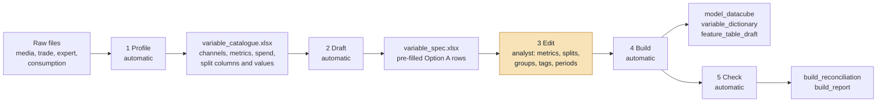
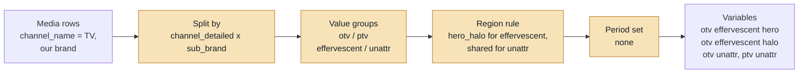

# Variable creation — design

> **Status:** planning, 2026-09-17. **No code yet.** This document designs one script, working name
> `build_variables.py`. It turns the raw media, trade, expert and consumption files into the model
> datacube and a draft feature table.
>
> **Companions** (same folder):
> - `EDA_CHECKS.md`: what is checked on the result.
> - `PHASE2_ARCHITECTURE.md`: the model.
> - `PHASE2_ARCHITECTURE.html`: the one-page overview.
>
> All three use the same running example (§1).

## Contents

0. Why this step exists
1. The running example
2. What comes in
3. What comes out
4. How it works: five steps
5. Option A: one variable per channel
6. Option B: recipes, to build variables the way the vendor does
7. Naming
8. Guardrails the builder enforces
9. What is automatic and what the analyst decides
10. Open questions

---

## 0. Why this step exists

Codebase 1 received variables someone else had built. None of the names in `feature_priors_v7.csv`
exist as a column in a raw file, for example
`media_tv_all-plac_otv_all-camp_sub-brand-effervescent_halo_grps_Liquid`. The vendor made them in
four moves:
- filter the media file on some columns;
- group the values of other columns;
- choose a metric;
- sometimes cut by period.

Codebase 2 starts from raw activity, so we build those variables ourselves. The builder has to be:

- **fast by default.** One variable per channel, and the only decision is the metric (Option A).
- **free when you want it.** Any split, merge, tag or period cut the vendor makes, and more (Option B).
- **auditable.** Every raw row lands in exactly one variable or is excluded on purpose, and a
  reconciliation file proves it.

**Scope decisions (2026-09-17)**

| Topic | Decision |
|---|---|
| Basis | **Sales volume**, as in codebase 1. No ROI anywhere. |
| Spend | Carried for the data checks, and used as the metric when a channel has nothing else (OOH, trade). |
| Competitor media | Combined into one variable by default. |
| Dummies | What a dummy means here is still to be defined, so none are built yet (§6.7). |
| TPR | Probably Price Promotions from the trade file. To be confirmed. |

---

## 1. The running example

The same example appears in every Phase 2 document. Its numbers are illustrative.

| | |
|---|---|
| Brand | our brand, with three sub-brands: **Effervescent, Liquid, Tabs** (the sub-brands in `feature_priors_v7.csv`) |
| Regions (the panel dimension) | the three sub-brands. Each sub-brand's sales is one series in the joint model |
| Calendar | weekly, 104 weeks |
| KPI | `Units EQ` from the consumption file: our brand, summed over SKUs and retail channels, per sub-brand-week |
| Media | TV (GRPs, open and pay TV), digital video and social (impressions), search (clicks), OOH (spend) |
| Trade | Price Promotions and Shopper spend, monthly, by retailer |
| Competitor | competitor TV GRPs, combined into one variable |

Why sub-brands as regions: it reproduces the vendor's hero / halo variables naturally (§6.4). The
region could equally be retail channel or retailer, because the builder takes the region column as a
setting.

---

## 2. What comes in

Column roles below are read from the snapshots in `data_structures/`.

### Media: one row per week × line item

| Role | Columns |
|---|---|
| Period | `week_start`, `week_end`, `month`, `year` |
| Market filter | `market_name`, `geography` |
| Product | `category`, `brand`, `sub_brand`, `target_sku` |
| **Main column** | `channel_name`: TV, Display, Search, Social, Video, BVOD, Ecommerce Display, Ecommerce Search, Ecommerce Social, Audio, Email, Website, Print, OOH, PR |
| Channel hierarchy | `channel_group` (offline / Digital), `channel_detailed` |
| Descriptors (candidate split columns) | `partner`, `campaign_name`, `audience`, `creative`, `spot_length`, `tv_day_part`, `video_format`, `is_branded`, `keyword_type_name`, `campaign_objective`, `program_type`, `targeting`, `placement`, `devices`, `ocp`, `is_sponsored`, `type_of_panels` |
| Money | `currency`, **`net_spend`** |
| Metrics | `impressions`, `click`, `views`, `grps`, `30s_eq_grps`, `panels`, `circulations`, `insertions`, `completed_video_views`, `session`, `viewable_impressions` |

Not every metric applies to every channel. `media_data_reference_matrix.png` marks which do:

| Channel | Metrics available |
|---|---|
| TV | `grps`, `30s_eq_grps` (no impressions) |
| Search | impressions, clicks |
| OOH | `panels` (and `type_of_panels`) |
| Print | `grps`, `circulations`, `insertions` |
| Website | `session`, `views` |

### Trade: one row per month × retailer × type

| Role | Columns |
|---|---|
| Period | `week_start`, `week_end`. **Monthly** despite the names (1 Dec – 31 Dec) |
| Market / product | `country`, `brand`, `sub_brand` |
| **Main column** | `type`: Shopper, Price Promotions |
| Sub-division | `sub_type` (POS, Trade Promotions), `retailer` (PhCh, DWS, GWS, SSS, Dcomm, Category, Fixed Expenses…), `media_vendor`, `objective`, `description` |
| Money | `currency`, `units` (= Spends), **`value`** |

Trade carries spend only, so spend is its metric.

### Expert: structure not yet seen

Designed the same way as media and trade:
- a main column: activity or type;
- a spend column;
- any count columns as metrics.

The exact columns are confirmed when a snapshot is available.

### Consumption: a long fact / value table

| Role | Columns |
|---|---|
| Period | `week` |
| Market | `country`, `geography` |
| Retail channel | `channel` (Supermarkets, Traditional, Pharmacy, Convenience) |
| Product | `category`, `sub_category`, `brand`, `sub_brand`, `sku`, `sku_code`, `pack_type`, `ingredient`, `size_range`, `size`, `form` |
| Owner | `global_manufacturer` (our company, or Competitor) |
| **Fact and value** | `facts` (Numeric Distribution, Weighted Distribution, Units EQ, Units, Value, …), `value` |

---

## 3. What comes out

| File | Contents |
|---|---|
| `model_datacube.csv` | one row per region × week: `date`, `region`, `dv`, then one column per variable. This is what codebase 2 reads |
| `variable_dictionary.csv` | one row per variable, with its full lineage: name, source, filters, split values, metric, spend column, period, region rule, unit, total metric, total spend, active weeks, recipe id |
| `build_reconciliation.csv` | per source × channel: raw total, total assigned to variables, total excluded (with the reason), and the difference, which must be 0 |
| `feature_table_draft.csv` | one row per variable, with defaults filled in from its family: transform, saturation, sign, pooling, baseline flag, pillar. The modeller's starting point |
| `build_report.md` | what was built, what was dropped and why, and every warning |

---

## 4. How it works: five steps

Steps 1, 2, 4 and 5 are automatic. Step 3 is where the analyst decides.

**Figure V1. The builder.**



**Step 1: Profile.** Reads each source and writes `variable_catalogue.xlsx`.
- **Per channel** (each value of the main column): active weeks, which metric columns are non-zero
  and their totals, spend total, currencies seen. This is the data-driven version of
  `media_data_reference_matrix.png`.
- **Per candidate split column**, within each channel: how many values it has, what they are, and each
  value's share of spend.
- **Per consumption fact**: the brands, sub-brands, retail channels and weeks it covers.

**Step 2: Draft.** Writes `variable_spec.xlsx` with one Option A row per channel, already filled in:
- **The suggested metric.** This is the non-zero metric highest in a per-channel preference list:
  - TV: `grps`, then `30s_eq_grps`;
  - Search: `click`, then `impressions`;
  - OOH: `panels`, otherwise `net_spend`.
- **The spend column.**
- **A generated name.**

Consumption rows are drafted from the facts found.

**Step 3: Edit.** For each row the analyst can:
- accept it;
- change the metric;
- switch the channel off;
- turn the row into an Option B recipe.

Nothing is built from a row until it says `enabled = 1`.

**Step 4: Build.** In order:
1. filter the rows;
2. assign each raw row to one variable;
3. align to the model calendar;
4. aggregate;
5. place on regions;
6. name;
7. write the outputs.

**Step 5: Check.** Runs the build checks, stage A of `EDA_CHECKS.md`. Above all, it confirms that every
raw row was assigned exactly once or excluded with a reason.

---

## 5. Option A: one variable per channel

The minimum the analyst supplies, per source:
- which column holds the channel;
- which column holds spend;
- for each channel, which column is the metric.

### 5.1 Media, trade and expert

**`sources` sheet**: one row per file.

| source | file | main_column | spend_column | period_start | period_end | brand_column | own_brands | region_column |
|---|---|---|---|---|---|---|---|---|
| media | media.csv | channel_name | net_spend | week_start | week_end | brand | our brand | sub_brand |
| trade | trade.csv | type | value | week_start | week_end | brand | our brand | sub_brand |
| expert | expert.csv | *TBC* | *TBC* | *TBC* | *TBC* | brand | our brand | sub_brand |

**`channels` sheet**: drafted in step 2, one row per channel.

| source | channel | metric_column | enabled | generated name |
|---|---|---|---|---|
| media | TV | grps | 1 | `media_tv_all-plac_all-plat_all-camp_sub-brand-unattr_grps` |
| media | Video | impressions | 1 | `media_digital-video_all-plac_all-plat_all-camp_sub-brand-unattr_impressions` |
| media | Social | impressions | 1 | `media_digital-social_all-plac_all-plat_all-camp_sub-brand-unattr_impressions` |
| media | Search | click | 1 | `media_digital-search_all-plac_all-plat_all-camp_sub-brand-unattr_clicks` |
| media | OOH | net_spend | 1 | `media_ooh_all-plac_all-plat_all-camp_sub-brand-unattr_invest` |
| trade | Price Promotions | value | 1 | `btl_price-promotions_all-btl_sub-brand-unattr_invest` |
| trade | Shopper | value | 1 | `btl_shopper_all-btl_sub-brand-unattr_invest` |

That is enough to build.
- Each channel's rows (our brand only) are summed per week.
- They are placed on regions by the default region rule (§6.4):
  - rows attributed to one sub-brand go to that sub-brand's region;
  - rows with no sub-brand (brand-level activity) go to every region.

### 5.2 Consumption

**`consumption` sheet**

| Output | Built from | Rule |
|---|---|---|
| **dv** (sales volume) | our brand, fact `Units EQ` | sum over SKUs and retail channels, then pivot to region (sub-brand) × week |
| **Category or competitor volume** | fact `Units EQ` for competitor brands (`global_manufacturer = Competitor`), or for all brands (category) | same pivot; choose `competitor` or `category` |
| **Base price** | a price fact, if present. Otherwise the analyst names the value fact (`Value`) and the unit fact (`Units`) | price = Σ value ÷ Σ units per region-week. Divide **after** summing; never average SKU prices |
| **TDP** | facts `Weighted Distribution` + `Numeric Distribution` | the user's definition: add the two facts, summed over SKUs within a region-week. See the retail-channel question in §10 |
| **Competitor price** | as base price, for competitor brands | same rule |
| **TPR** | *to be confirmed*: likely trade `Price Promotions` | not built until confirmed |

Names follow the vendor pattern:
- `sales_brand_all-benefit_distribution_tdp`
- `sales_brand_all-benefit_price_base-price`
- `sales_market_all-benefit_base_sales-volume`
- `sales_market_all-benefit_price_base-price`

### 5.3 Competitor media

By default, competitor media is **one** variable. It is every competitor row in the media file (brand
not ours), or a separate competitor file, summed over all channels.

| Case | Result |
|---|---|
| Every competitor row carries the same metric, e.g. all TV with GRPs | `media_competitor-tv_all-plac_all-plat_all-camp_sub-brand-unattr_grps` |
| Channels carry different metrics | the builder refuses to add GRPs to impressions, uses `net_spend` instead (`…_competitor_…_invest`), and says so in the report |

The variable is placed on every region (`shared`).

---

## 6. Option B: recipes, to build variables the way the vendor does

A **recipe** is one row that turns a slice of one source into one or more variables. It answers six
questions:

1. **Which rows?** The channel (a value of the main column), plus any extra filters.
2. **How to split?** Which descriptor columns divide the channel. Chosen per channel.
3. **How to group values?** For each split column: keep a value on its own, merge values, drop
   values, rename, add tags.
4. **Which metric?** Optionally a different one per split.
5. **How to place on regions?** Shared, matched, or hero / halo.
6. **How to cut time?** No cut, calendar years, MAT blocks, or custom periods.

The builder then:
- expands a recipe into every combination of kept groups × periods;
- drops the combinations with no activity, and lists them in the report;
- names each result.

**Figure V2. One recipe, expanded.**



### 6.1 Split columns, chosen per channel

Step 1 lists the candidate split columns and their values for each channel. The analyst picks.
Typical choices:

| Channel (main column value) | Split columns an analyst might pick | Why |
|---|---|---|
| TV | `sub_brand`, and the column holding open vs pay TV (e.g. `channel_detailed`) | hero / halo by sub-brand; open vs pay TV |
| Video, Social, Display | `sub_brand`, and `placement` or `partner` | sub-brand attribution; platform |
| Search | `keyword_type_name` or `is_branded` | branded vs generic search |
| OOH | none, but split by period | one activity, cut by year |
| Trade: Price Promotions | `retailer` | retailer-level promotions |
| Trade: Shopper | `sub_type` (POS, …) | activity type |
| Expert (activity column TBC) | TBC | |

### 6.2 Value groups: keep, merge, drop, rename, tag

**`value_groups` sheet**
- One row per recipe × split column × raw value.
- Pre-filled with every value found, with group = the value itself, so the analyst edits only what
  should change.
- Rows marked *analyst's call* are decisions for the team, not recommendations.

| recipe | column | value | group | tag | note |
|---|---|---|---|---|---|
| tv | sub_brand | Effervescent | effervescent | | region rule decides hero / halo (§6.4) |
| tv | sub_brand | Liquid | liquid | | |
| tv | sub_brand | Tabs | tabs | | |
| tv | sub_brand | NA | unattr | | brand-level activity |
| tv | channel_detailed | Open TV | otv | | |
| tv | channel_detailed | Pay TV | ptv | | |
| trade_pp | retailer | PhCh | phch | | |
| trade_pp | retailer | Category | `all` | | *analyst's call*: category-level spend, not tied to one retailer |
| trade_pp | retailer | Fixed Expenses | `drop` | | *analyst's call*: overhead rather than activity |

| Entry | Effect |
|---|---|
| **Same group label on several values** | the values merge. E.g. `Liquid` and `Tabs` both labelled `liquid-tabs` |
| **`drop`** | the rows are excluded, counted as excluded, and the reason goes into the reconciliation |
| **`all`** | the column is not split (all its values are summed) |
| **tag** | free words added to the name: `hero`, `halo`, `launch`, anything from the team's own study |

### 6.3 Period splits

**`periods` sheet**: named period sets, each a list of labelled date ranges.

| period_set | label | start | end |
|---|---|---|---|
| calendar | 2024 | 2024-01-01 | 2024-12-31 |
| calendar | 2025 | 2025-01-01 | 2025-12-31 |
| mat | mat1 | first week | week 52 |
| mat | mat2 | week 53 | week 104 |

- A recipe with `period_set = calendar` produces `…_invest_2024` and `…_invest_2025`.
- Each period variable is zero outside its range, so the pieces add back to the unsplit variable
  exactly. The builder checks this.
- `mat` blocks can be generated from the last date (52 + 52 weeks), the same way codebase 1's
  `period_split: mat` does.

**Figure V3. A period split.**

```
week               1 ─────────────── 52 │ 53 ─────────────── 104
unsplit OOH spend  ████████████████████ │ ████████████████████
…_invest_2024      ████████████████████ │ 0 0 0 0 0 0 0 0 0 0 0
…_invest_2025      0 0 0 0 0 0 0 0 0 0 0│ ████████████████████
                   2024 + 2025 = unsplit, every week (checked)
```

### 6.4 Placing variables on regions

The region is the panel dimension; in the example, sub-brand. Each recipe picks one rule:

| Rule | What each region receives | Use for |
|---|---|---|
| `shared` | the channel total, identical in every region | national activity with no sub-brand attribution; competitor media |
| `matched` | only the rows whose region column equals that region | activity booked to one sub-brand |
| `hero_halo` | two variables per sub-brand group. **Hero** is the group's activity in its own region; **halo** is the same activity in the other regions | the vendor's hero / halo construction |
| `per_region_columns` | one column per region, zero elsewhere (vendor style, e.g. `…_grps_Liquid`) | reproducing a vendor file exactly, for comparison |

**Vendor suffix columns collapse in a panel.** The vendor's region-suffixed columns
(`…_unattr_grps_Effervescent`, `…_Liquid`, `…_Tabs`) become **one** `shared` variable. Its coefficient
varies by region through pooling. `per_region_columns` exists only to reproduce a vendor file side by
side.

**Figure V4. Hero / halo in the example.** One week, 120 GRPs of TV attributed to Effervescent, plus
80 GRPs of brand-level TV.

```
                                                   region:  Effervescent   Liquid   Tabs
media_tv_all-plac_otv_all-camp_sub-brand-effervescent_hero_grps     120          0        0
media_tv_all-plac_otv_all-camp_sub-brand-effervescent_halo_grps       0        120      120
media_tv_all-plac_otv_all-camp_sub-brand-unattr_grps                 80         80       80   ← shared
```

### 6.5 The v7 variables, rebuilt as recipes

| v7 variable(s) | Recipe |
|---|---|
| `media_tv_all-plac_otv_all-camp_sub-brand-effervescent_hero_grps`, plus `…_halo_grps_Liquid` / `_Tabs` | TV · split open-vs-pay column (otv) and `sub_brand` (effervescent) · metric `grps` · region `hero_halo` |
| `media_tv_all-plac_otv_all-camp_sub-brand-unattr_grps_Effervescent` / `_Liquid` / `_Tabs` | TV · otv · `sub_brand` NA → `unattr` · region `shared`, as one panel variable |
| `media_tv_all-plac_ptv_all-camp_sub-brand-unattr_grps_*` | TV · ptv · `unattr` · region `shared` |
| `media_digital-video_…_sub-brand-effervescent_hero_impressions`, `…_halo_…`, `…_unattr_…` | Video · `sub_brand` · metric `impressions` · region `hero_halo` for effervescent, `shared` for unattr |
| `media_ooh_all-plac_all-plat_all-camp_sub-brand-unattr_invest_2024` / `_2025` | OOH · no split · metric `net_spend` · period set `calendar` |
| `btl_price-promotions_all-btl_sub-brand-unattr_invest_*` | trade `type` = Price Promotions · metric `value` · region `shared` |
| `btl_shopper_all-btl_sub-brand-unattr_invest_*` | trade `type` = Shopper · metric `value` · region `shared` |
| `media_competitor-tv_all-plac_all-plat_all-camp_sub-brand-unattr_grps` | competitor media · combined · `grps` · `shared` |
| `sales_brand_all-benefit_distribution_tdp_*` | consumption TDP rule · region `matched` (sub-brand) |
| `sales_brand_all-benefit_price_base-price_*` | consumption price rule · region `matched` |
| `sales_market_all-benefit_base_sales-volume` | consumption category volume · region `shared` |

### 6.6 Consumption splits

The consumption outputs in §5.2 can be split too, by sub-brand, retail channel, pack or any other
column, or kept as they are.
- Example: `sales_market_all-benefit_price_base-price_Tabs` is category price restricted to Tabs.
- The same value-group and period machinery applies.

### 6.7 Dummies

Not designed yet.
- The builder reserves a `dummies` sheet (name, start, end, value, regions). A dummy can then be added
  without a code change once the team defines what a dummy is in our context: an on/off switch for an
  event window, a permanent step, or a decaying effect.
- `feature_priors_v7.csv` has 21 `dummy_*` rows. Their meaning should be settled before any are
  rebuilt.

---

## 7. Naming

Names follow the vendor grammar in `feature_priors_v7.csv`, so our variables and theirs line up in the
benchmark sheet.

**Figure V5. The name grammar.**

```
<source>_<channel>_<placement>_<platform>_<campaign>_<sub-brand block>_<metric>[_<extra words>][_<period>]

media _ tv               _ all-plac _ otv      _ all-camp _ sub-brand-effervescent_hero _ grps
media _ ooh              _ all-plac _ all-plat _ all-camp _ sub-brand-unattr           _ invest _ 2025
btl   _ price-promotions _ all-btl                        _ sub-brand-unattr           _ invest
sales _ brand            _ all-benefit _ distribution     _ tdp
```

| Rule | Detail |
|---|---|
| Slots | Each slot is filled from the split column mapped to it: placement ← `placement`; platform ← the open / pay TV column; campaign ← `campaign_name` or `campaign_objective`; sub-brand ← `sub_brand`. An unsplit slot reads `all-<slot>` |
| Extra split columns | A split column with no slot is appended before the metric |
| Values | Lower-cased. Spaces and underscores inside a value become hyphens |
| Metric word | Normalised: `net_spend` and `value` → `invest`; `click` → `clicks` |
| Overrides | An `alias` column overrides the generated name. The dictionary keeps both |
| Uniqueness | The builder refuses duplicate names |

---

## 8. Guardrails the builder enforces

| Rule | Why | If broken |
|---|---|---|
| Every raw row is assigned to exactly one variable, or excluded with a reason | no double counting; nothing silently lost | error. `build_reconciliation.csv` shows the difference |
| Only one metric unit is summed into a variable | GRPs + impressions is meaningless | error. Use spend, or split the channel |
| Split groups partition the channel | overlapping groups double-count | error |
| Period pieces add back to the unsplit variable | a gap or overlap in the period table | error |
| One currency per spend total | the media snapshot mixes JPY and USD; trade is MXN | error, unless a conversion table is supplied |
| Calendar alignment | sources use different week starts; trade is monthly | weeks are mapped by day overlap; a month is spread over its weeks in proportion to days; the report says so |
| Non-additive facts aggregated correctly | price and distribution are not sums | price = Σ value ÷ Σ units; distribution is not added across retail channels (§10) |
| Combinations with no activity are dropped | an empty column is not a variable | listed in the report |
| Few active weeks | a variable active in fewer than 5 weeks is a memorised residual (codebase 1's `Dummy` lesson) | warning |
| Names are unique | two recipes producing one name | error |

---

## 9. What is automatic and what the analyst decides

| Decision | Who | Default |
|---|---|---|
| Which files, which market, which brands are ours | analyst, once | the `sources` sheet |
| Channel list, and which metrics exist per channel | automatic (step 1) | — |
| Metric per channel | suggested; the analyst confirms | preference list |
| Split columns per channel | analyst | none (Option A) |
| Merging, dropping, renaming values; tags | analyst | every value on its own |
| Region rule | suggested from attribution | `matched` if the row has a sub-brand, otherwise `shared` |
| Period cuts | analyst | none; `mat` generated on request |
| Names | automatic | vendor grammar; `alias` overrides |
| Calendar alignment, monthly spreading | automatic | the model's week convention |
| Reconciliation, dropping empty combinations, unit guard | automatic | always on |
| Feature-table defaults: transform, sign, pillar, baseline | automatic from the family; the modeller edits | `PHASE2_ARCHITECTURE.md` §6 |

Different recipe choices are model specifications. Hero / halo TV versus one combined TV variable is an
example. Expanding-window cross-validation compares them the same way it compares any other
specification (`PHASE2_ARCHITECTURE.md`, and Phase 6 of the one-page overview).

---

## 10. Open questions

| Question | Why it matters | Default until answered |
|---|---|---|
| Where TPR comes from | TPR is a Trade driver in v7 | not built. Likely trade Price Promotions |
| What a dummy is in our context | a switch, a step or a decay is built differently | not built |
| The expert file's columns | its main column, spend and metrics | design ready; columns to confirm |
| The region column for the next model | sub-brand, retail channel or retailer | a setting; the example uses sub-brand |
| The TDP definition across retail channels | The user's rule adds Weighted and Numeric Distribution. Distribution is a share of stores: adding it across SKUs gives distribution points, but adding it across retail channels counts the same stores more than once | add WD + ND, summed over SKUs. Across retail channels, take a sales-weighted average. To confirm |
| Base price | Value ÷ Units is average price, including promotions. A true base (regular) price needs its own fact | use a price fact when present; otherwise Value ÷ Units, labelled as average price |
| Week convention | the media snapshot's weeks run Monday–Sunday; codebase 1's datacube weeks start on Sunday | the model's week start is a setting; every source is mapped by day overlap |
| Currency | the media snapshot mixes USD and JPY; trade is MXN | one market per build; an optional conversion table |
| How competitors are identified | `global_manufacturer = Competitor`, or a brand list | `global_manufacturer` |
